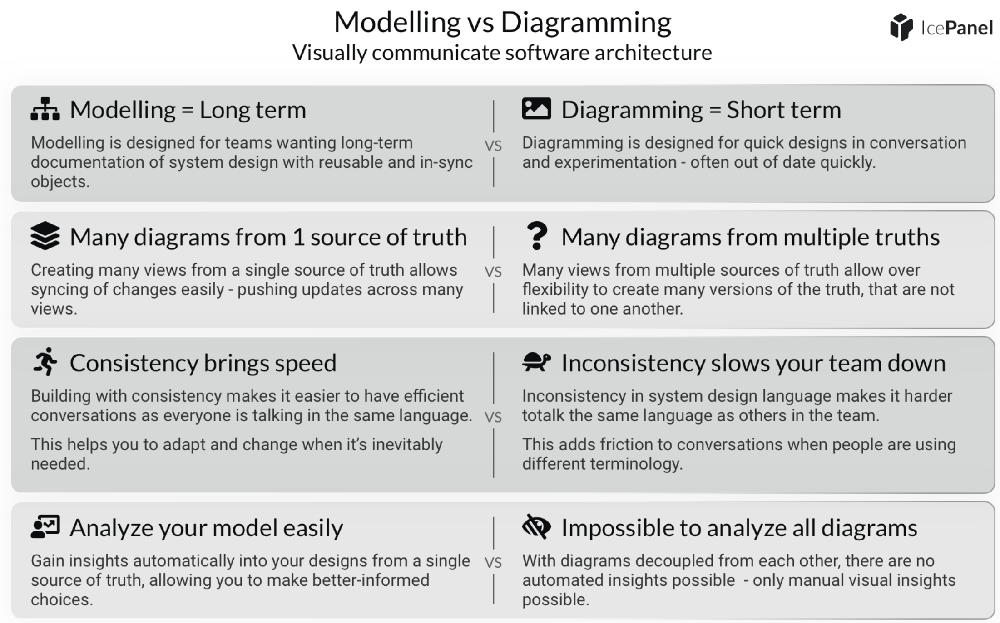
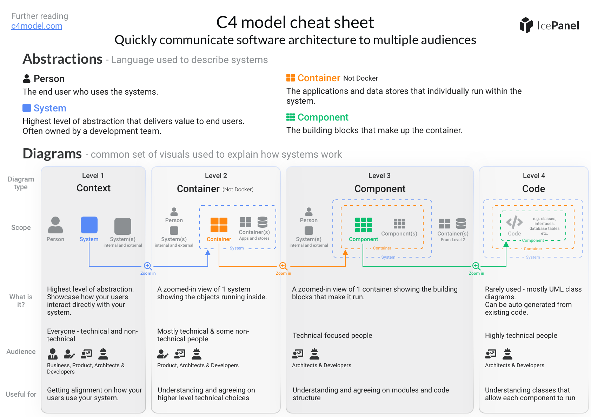

---
tags:
  - Architecture
  - Outbox_Pattern
  - Inbox_Pattern
  - C4
---
# Architecture

- [Architecture](#Architecture)
	- [DDD](./DDD.md)
	- [CQRS](./CQRS.md)
- [C4](#C4)
- [Other](#Other)
- [Links](#Links)

**Outbox Pattern** #Outbox_Pattern  - it ensures that a message was sent (e.g. to a queue) successfully at least once. With this pattern, instead of directly publishing a message to the queue, we store it in temporary storage (e.g. database table).

**Inbox Pattern** #Inbox_Pattern - it is similar to Outbox Pattern. It’s used to handle incoming messages (e.g. from a queue). Accordingly, we have a table in which we’re storing incoming events. Contrary to outbox pattern, we first save the event in the database, then we’re returning ACK to queue

### Delivery Guarantees

- **At-most once**
- **At-least once**
- **Exactly-once**

## Modelling vs Diagramming

## #C4

[C4 Model - Getting Started Workshop by IcePanel](https://miro.com/app/board/uXjVPEoyaok=/?fromEmbed=1)

# Other

### ShedLock

ShedLock — a Java library that makes sure our scheduled tasks run only once at the same time **and is an alternative to [Quartz](https://www.baeldung.com/quartz)**

### #TOGAF 
[The Open Group Architecture Framework](https://en.wikipedia.org/wiki/The_Open_Group_Architecture_Framework#:~:text=TOGAF%20is%20a%20high%2Dlevel,existing%2C%20proven%20technologies%20and%20products.) -  [Enterprise architecture framework](https://en.wikipedia.org/wiki/Enterprise_Architecture_framework "Enterprise Architecture framework") for [Enterprise Architecture](https://en.wikipedia.org/wiki/Enterprise_architecture "Enterprise architecture")  that provides an approach for designing, planning, implementing, and governing an enterprise information technology architecture. TOGAF is a high-level approach to design. It is typically modeled at four levels: Business, Application, Data, and Technology. It relies heavily on modularization, standardization, and already existing, proven technologies and products.

# Links

[# Outbox, Inbox patterns and delivery guarantees explained](https://event-driven.io/en/outbox_inbox_patterns_and_delivery_guarantees_explained/) #Outbox_Pattern 

[# ShedLock with Spring](https://www.baeldung.com/shedlock-spring) 
