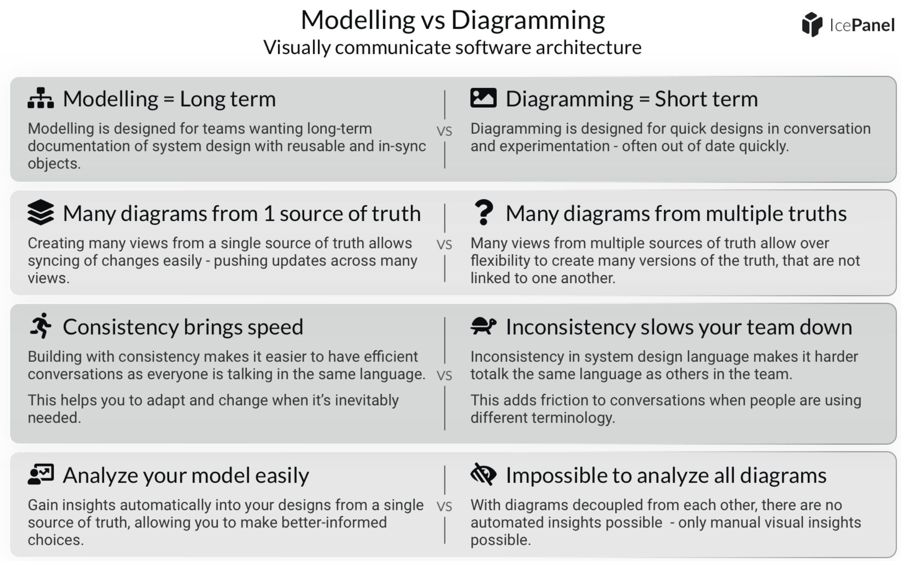
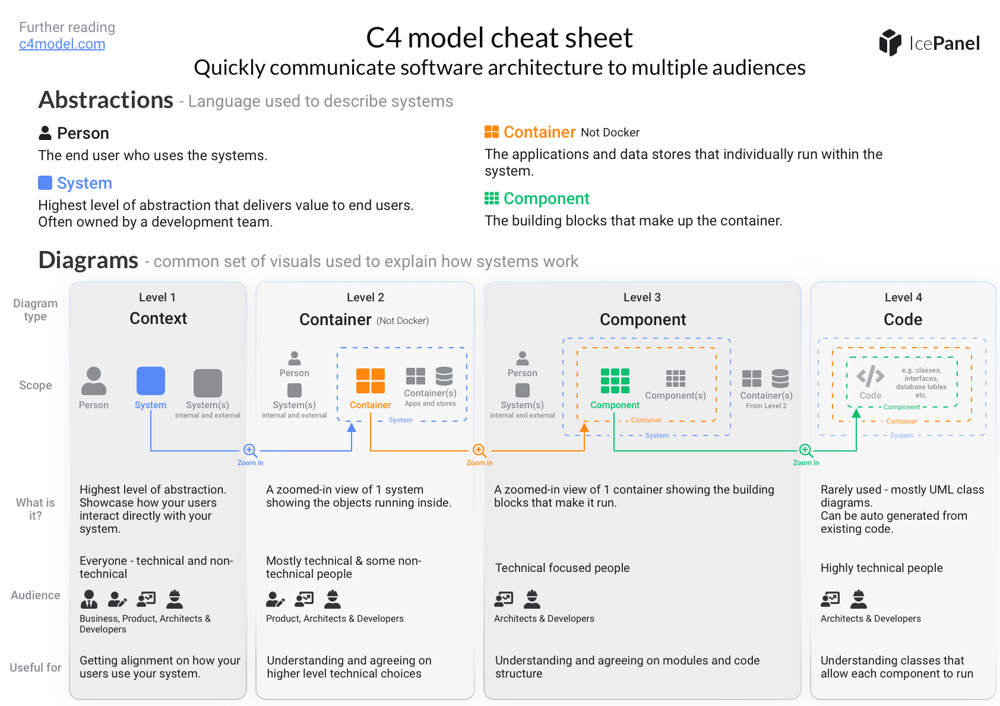

---
tags:
  - Architecture
  - Outbox_Pattern
  - Inbox_Pattern
  - C4
---
# #Architecture
_Never shoot for the best architecture, but rather the least worst architecture._

In system design, prioritizing a pragmatically sufficient architecture over an idealized model often results in more sustainable and maintainable solutions. Focusing on the least suboptimal approach acknowledges trade-offs and real-world constraints.

- [Architecture](#Architecture)
	- [DDD](./DDD.md)
	- [CQRS](./CQRS.md)
	- [Human-Friendly IDs](./Human-Friendly-IDs.md)
- [Docs](#Docs)
- [C4](#C4)
- [Tools](#Tools)
- [Other](#Other)
- [Links](#Links)

**Outbox Pattern** #Outbox_Pattern  - it ensures that a message was sent (e.g. to a queue) successfully at least once. With this pattern, instead of directly publishing a message to the queue, we first save it in a dedicated table inside the same database transaction as the business update. A separate process then reads pending records and publishes them. This avoids the inconsistency where the database commit succeeds but the message publish fails.

**Inbox Pattern** #Inbox_Pattern - it is similar to Outbox Pattern. It’s used to handle incoming messages (e.g. from a queue). Accordingly, we have a table in which we’re storing incoming events and tracking whether they were already processed. This helps guarantee idempotent handling and prevents duplicate processing.

### Delivery Guarantees

- **At-most once**
- **At-least once**
- **Exactly-once**

## Modelling vs Diagramming

## #Docs

### ADRs - (Architecture Decision Records)

ADR statuses:
- Request for Comment (RFC)
- Proposed
- Accepted
- Superseded

## #C4

[C4 Model - Getting Started Workshop by IcePanel](https://miro.com/app/board/uXjVPEoyaok=/?fromEmbed=1)

[The C4 model for visualising software architecture](https://c4model.com/)

# #Tools

[Mermaid](https://mermaid.live/)

[PlantUML](https://plantuml.com/)

[Structurizr](https://structurizr.com/)

[Archi](https://www.archimatetool.com/)

[C4 DSL Model Extension for Visual Studio Code](https://github.com/tech-beeline/varp)

[arc42](https://arc42.org/)
[arc42 - software architecture](https://github.com/arc42)

# Other

### ShedLock

ShedLock — a Java library that makes sure our scheduled tasks run only once at the same time **and is an alternative to [Quartz](https://www.baeldung.com/quartz)**

### #TOGAF 
[The Open Group Architecture Framework](https://en.wikipedia.org/wiki/The_Open_Group_Architecture_Framework#:~:text=TOGAF%20is%20a%20high%2Dlevel,existing%2C%20proven%20technologies%20and%20produc[...]

# Links

[SOFTWARE ARCHETYPES](https://softwarearchetypes.com/)

[Outbox, Inbox patterns and delivery guarantees explained](https://event-driven.io/en/outbox_inbox_patterns_and_delivery_guarantees_explained/) #Outbox_Pattern 

[ShedLock with Spring](https://www.baeldung.com/shedlock-spring) 
