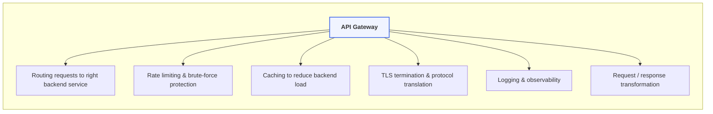

---
tags:
  - System_Design
  - API_Gateway
---

# #System_Design

[https://github.com/donnemartin/system-design-primer?tab=readme-ov-file](https://github.com/donnemartin/system-design-primer?tab=readme-ov-file)

## API Gateway

### Core responsibilities typically include:

- Routing requests to the right backend service
- Rate limiting and brute force protection
- Caching to reduce backend load
- TLS termination and protocol translation
- Logging and observability for monitoring traffic
- Request/response transformation for adapting formats

# #Link 

[Design Guru - Grokking the System Design Interview](https://www.designgurus.io/course/grokking-the-system-design-interview?aff=84Y9hP)

[educative](https://www.educative.io/)

[educative - Grokking Modern System Design Interview for Engineers & Managers](https://www.educative.io/courses/grokking-modern-system-design-interview-for-engineers-managers)

