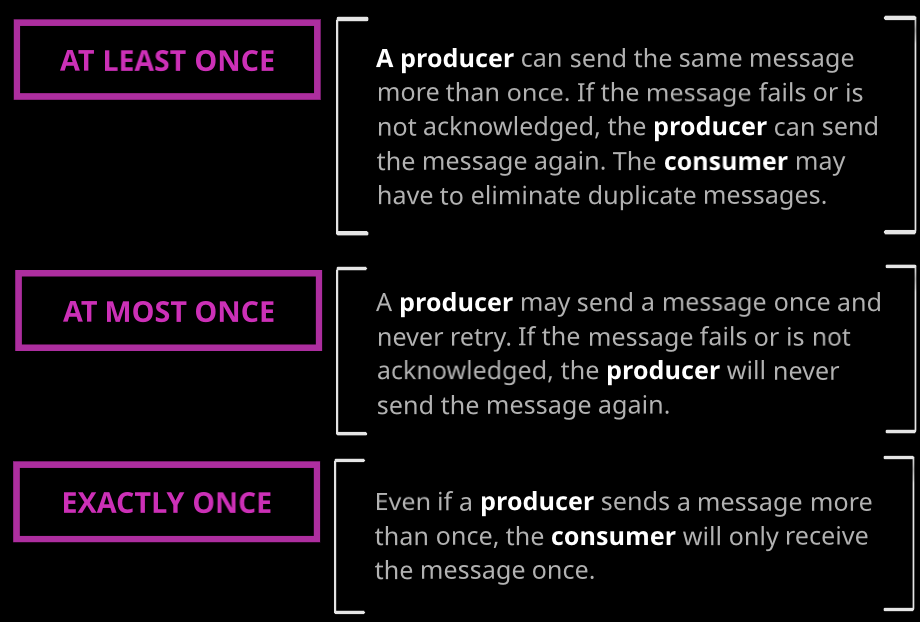
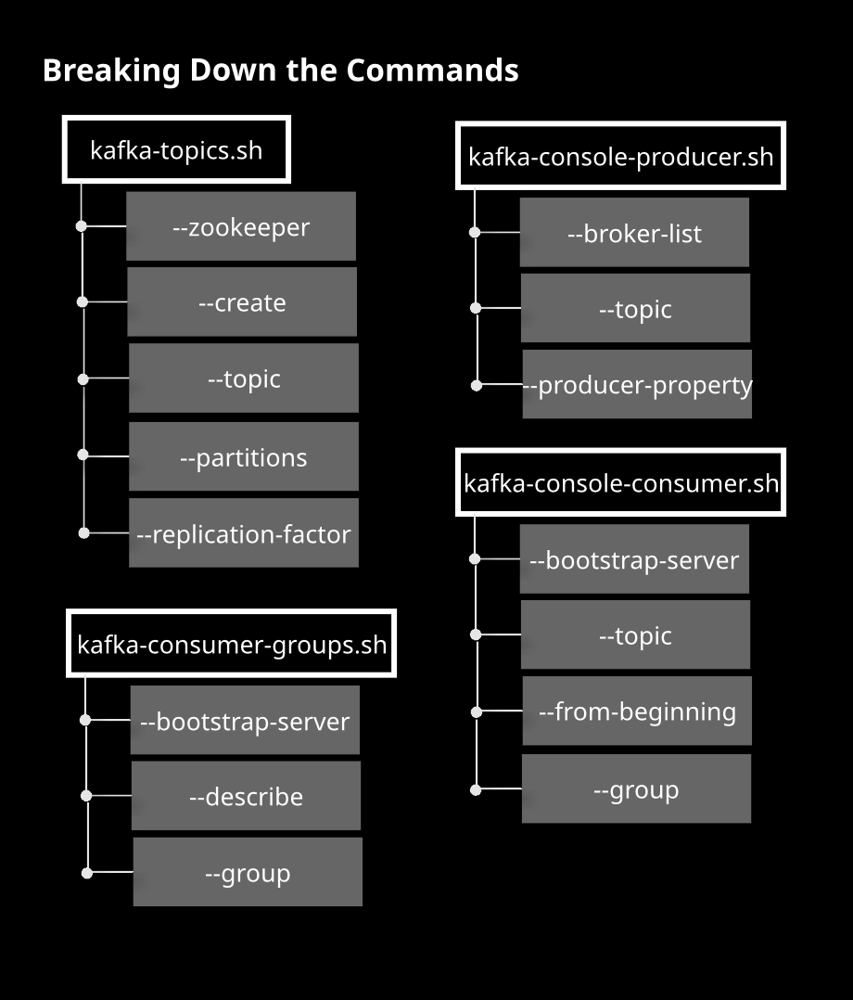

---
tags:
  - Kafka
---

# #Kafka

[Kafka Visualization](https://softwaremill.com/kafka-visualisation/)

[Kafka Monitoring](https://kafka.apache.org/documentation/#monitoring)

[Kafka Security]([https://kafka.apache.org/documentation/#security](https://kafka.apache.org/documentation/#security))

#### Kafka trust properties
[spring.kafka.consumer.properties.spring.json.trusted.packages](http://spring.kafka.consumer.properties.spring.json.trusted.packages) specifies comma-delimited list of package patterns allowed for deserialization. '*' means deserialize all packages.

## Message delivery

* none: The producer considers the records successfully delivered once it sends the records to the broker. This is basically “fire and forget.”
* one: The producer waits for the lead broker to acknowledge that it has written the record to its log.
* all: The producer waits for an acknowledgment from the lead broker and from the following brokers that they have successfully written the record to their logs.

### **Message Delivery Semantics**

- _At most once_—Messages may be lost but are never redelivered.
    
- _At least once_—Messages are never lost but may be redelivered.
    
- _Exactly once_—this is what people actually want, each message is delivered once and only once.

## Consumer Groups

### Understanding Kafka Consumer Offsets

1. **Topics Have Multiple Partitions**
   
   In Kafka, a **topic** is divided into several **partitions**. Each partition is an ordered, immutable sequence of messages that allows Kafka to scale horizontally by distributing data across multiple brokers. This partitioning enables parallel processing and improves the throughput of message consumption.

2. **Topics Can Have Multiple Consumer Groups**
   
   A single **topic** can be consumed by multiple **consumer groups** simultaneously. Each consumer group operates independently, allowing different applications or services to process the same stream of data without affecting each other. This setup enhances flexibility and scalability in how data is consumed and utilized.

3. **One Consumer per Partition per Consumer Group**
   
   Within a **consumer group**, each **partition** is assigned to only one **consumer**. This means that a single consumer is responsible for reading messages from a specific partition, ensuring that messages are processed in order and preventing duplicate consumption. If a consumer fails, Kafka can reassign the partition to another consumer in the group to maintain continuity.

4. **Consumer Offset Managed at Partition Level per Consumer Group**
   
   A **consumer offset** tracks the last message a consumer has successfully processed in a partition. These offsets are managed individually for each partition within a consumer group. This granular management allows consumers to resume processing from the exact point they left off in case of restarts or failures, ensuring reliable and efficient message consumption without duplication.

## Commands

