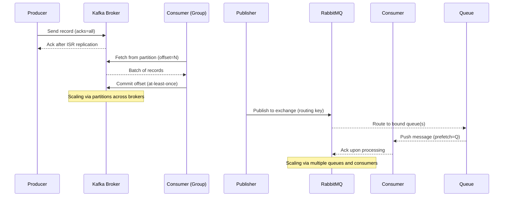
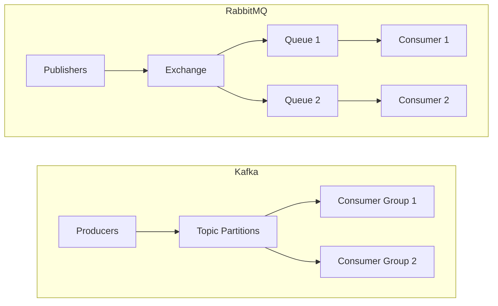

- [Big picture](#big-picture)
- [Design differences (cheat sheet)](#design-differences-cheat-sheet)
- [Consumer patterns](#consumer-patterns)
- [Message routing](#message-routing)
- [When to use which](#when-to-use-which)
  - [Use Kafka when:](#use-kafka-when)
  - [Use RabbitMQ when:](#use-rabbitmq-when)
- [Delivery guarantees and recovery](#delivery-guarantees-and-recovery)
- [Quick decision flow](#quick-decision-flow)
- [Mnemonics](#mnemonics)
- [Interview-ready lines](#interview-ready-lines)
- [Examples to visualize](#examples-to-visualize)
- [Glossary](#glossary)
- [Super-condensed recap](#super-condensed-recap)
- [Mermaid](#mermaid)
  - [Sequence diagram](#sequence-diagram)
  - [Flowchart](#flowchart)

## Essence in one sentence
- Kafka = stream processing for high-throughput events and fan-out;
- RabbitMQ = traditional message queue for task processing, complex routing, and one-to-one delivery.

---

## Big picture
- Kafka: Stream processing system. Ingests a continuous event stream and delivers it to many consumers; retains events for replay.
- RabbitMQ (traditional queues): Message queuing system. Buffers tasks/messages until a worker is ready; routes each message to exactly one consumer by default.

---

## Design differences (cheat sheet)

| Dimension | Kafka (Stream Processing) | RabbitMQ (Traditional Queue) |
|---|---|---|
| Purpose | Distribute event streams to many consumers | Dispatch tasks/messages to workers |
| Throughput | Very high | Moderate (still fast) |
| Storage | Keeps messages until TTL; supports replay | Not oriented around replaying consumed messages |
| Default delivery | Fan-out: all consumers get the events | One-to-one: one message → one consumer |
| Routing | Producer decides topic/partition | Exchange routes messages to queues (bindings) |
| Fan-out support | Natural/default pattern | Possible via exchange duplications |
| Workload shape | Many small, uniform, short-handling events | Long-running, variable-duration tasks; bursty workloads |
| Acks model | Offsets (commit after processing) | Acknowledgements (redeliver if no ack) |

Note: Both can emulate the other pattern with extra setup, but it’s less scalable than their native mode.

---

## Consumer patterns
- Kafka: Fan-out by default
  - Multiple consumers can receive the same events stream when configured to do so.
  - Great when the same event must feed logging, analytics, and real-time user updates simultaneously.
- RabbitMQ: One-to-one by default
  - Multiple workers attached to a queue; each message is delivered to exactly one worker.
  - Scales well by adding replicas of processors/workers.

---

## Message routing
- Kafka (producer-driven):
  - Producer selects topic/partition (e.g., via hashing on message key).
  - No central router: helps scale throughput.
  - Trade-off: Little control after production; routing is fixed once published.

- RabbitMQ (exchange-driven):
  - Messages go to an Exchange, which routes to queues via bindings/keys.
  - Can duplicate messages across queues for fan-out style delivery.
  - Consumers gain better control and load balancing, especially when tasks take variable time.

---

## When to use which

### Use Kafka when:
- You have uniform events with short processing per message.
- You need to fan out the same events to many downstream systems.
- You need extremely high throughput.
- You have a consistent stream of many small events (e.g., telemetry).
- Common use cases:
  - Stream data analysis
  - Event bus across services
  - Centralized logging pipelines
  - Real-time client updates/notifications

### Use RabbitMQ when:
- Tasks are long-running and/or have unpredictable processing time.
- You need complex routing logic.
- Traffic is sporadic or bursty.
- You’re running worker/job queues and want one-at-a-time processing with backpressure.
- Common use cases:
  - Job/worker systems (background tasks)
  - Simple microservice decoupling with robust redelivery and error handling

---

## Delivery guarantees and recovery

- Kafka: Offsets
  - Consumer fetches from its last committed offset; after processing, it commits the new offset.
  - If a consumer dies before commit, another consumer continues from the last committed offset (implicit redelivery of uncommitted data).
  - Suited for batch-like consumption of many small events.

- RabbitMQ: Acknowledgements
  - Consumer receives message, processes, then sends an ack.
  - If ack isn’t received within a window, the message is redelivered to another consumer.
  - Suited for long-running tasks where explicit completion/failure is important.

---

## Quick decision flow
1) Do many independent systems need the same event? → Kafka  
2) Is throughput a primary constraint? → Kafka  
3) Are messages tasks that one worker should process exactly once? → RabbitMQ  
4) Are tasks long/variable with need for explicit success/failure? → RabbitMQ  
5) Is routing complex and consumer-controlled via bindings? → RabbitMQ  
6) Is replay of past events important? → Kafka

---

## Mnemonics
- KAFKA = Keep events, Kopy to many, Kilo-throughput, Konsume by offset
- RABBITMQ = Routes via eXchange, Acknowledges tasks, Bursty & long Jobs, One-message-one-consumer

---

## Interview-ready lines
- “Kafka is optimized for high-throughput stream fan-out and event replay; RabbitMQ is optimized for reliable task distribution, complex routing, and acknowledgements.”
- “In Kafka, producers choose partitions; in RabbitMQ, exchanges route to queues.”
- “Kafka uses committed offsets; RabbitMQ uses acknowledgements with redelivery.”

---

## Examples to visualize
- Kafka:
  - One event → Logging + Real-time dashboards + Analytics at the same time.
- RabbitMQ:
  - Image-processing jobs → a pool of workers; each job goes to exactly one worker; redelivered if a worker fails.

---

## Glossary
- Topic/Partition (Kafka): Logical stream split into partitions for scale.
- TTL: Time-to-live for messages in Kafka retention.
- Offset: Position marker in Kafka a consumer commits after processing.
- Exchange (RabbitMQ): Router that distributes messages to queues.
- Queue (RabbitMQ): Buffer consumed by workers.
- Ack: Confirmation from consumer that processing succeeded (RabbitMQ).

---

## Super-condensed recap
- Kafka: stream, fan-out, replay, producer-chosen partitions, offsets, very high throughput, consistent small events.
- RabbitMQ: queue, one-to-one tasks, exchange routing, acknowledgements/redelivery, handles long/variable tasks and bursts.

## Mermaid

