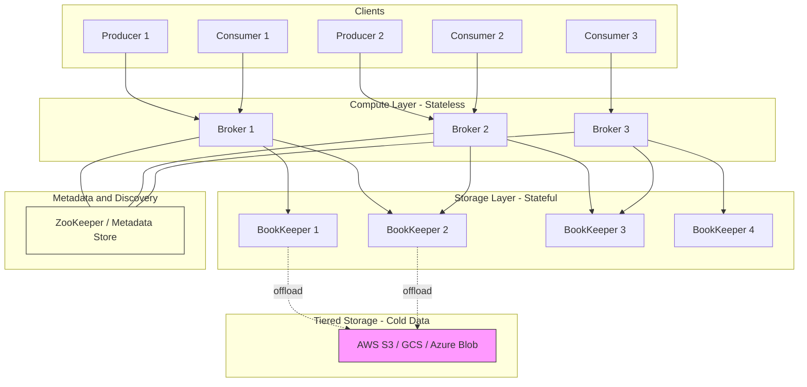
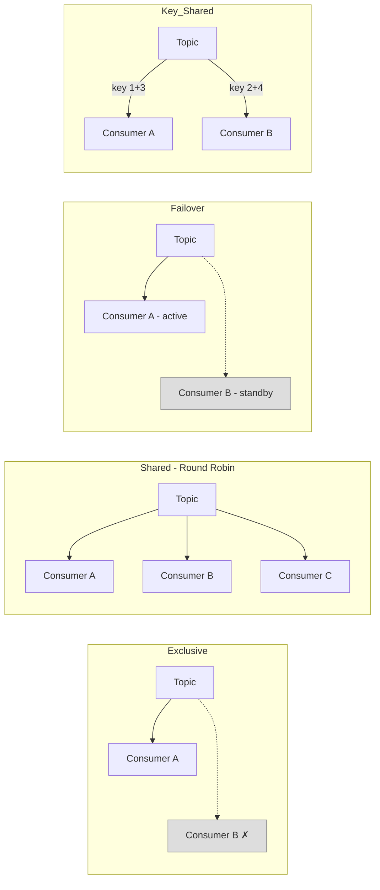
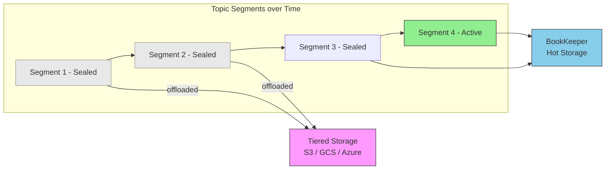
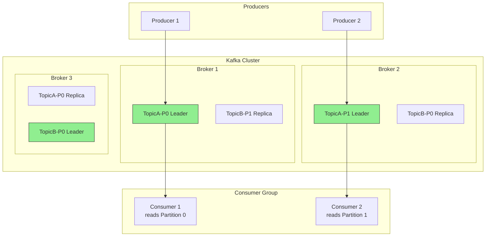
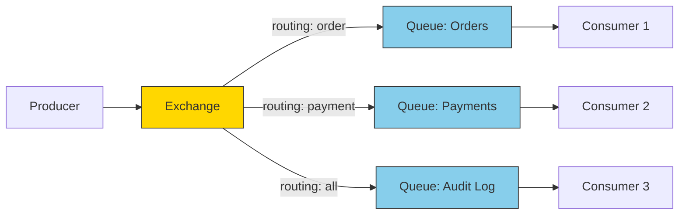
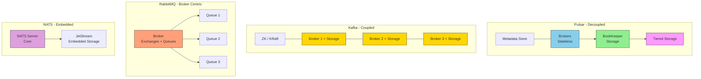
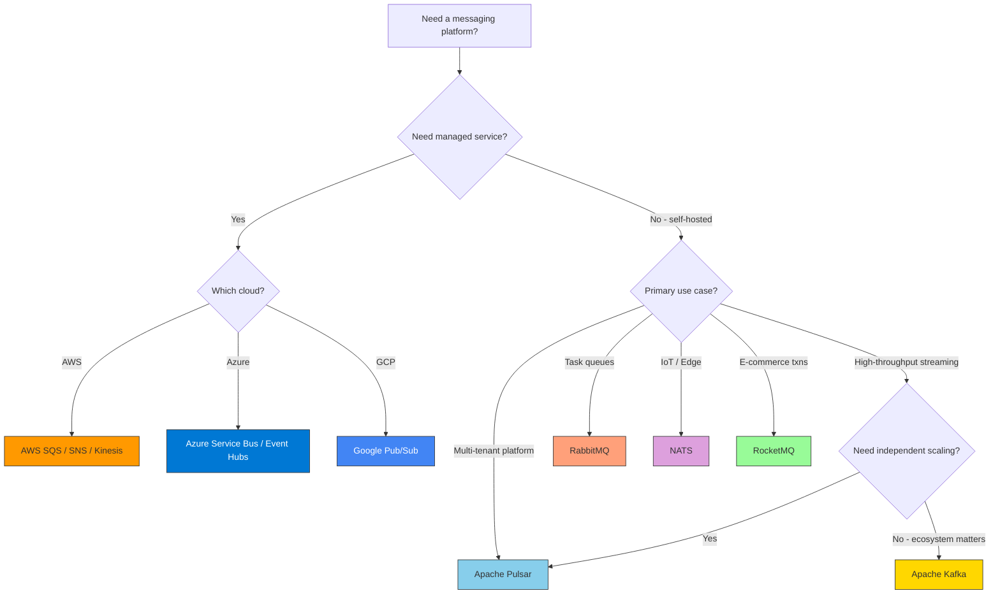

# Apache Pulsar and Similar Messaging Platforms

## What is Apache Pulsar?

[Apache Pulsar](https://pulsar.apache.org/) is a **multi-tenant, high-performance distributed messaging and streaming platform** originally developed at Yahoo and now an Apache Software Foundation top-level project. It is designed for server-to-server messaging, event streaming, and queuing at scale.

### Core Architecture

Pulsar's defining architectural feature is the **separation of compute and storage**:

- **Brokers** handle message routing, client connections, and protocol logic (compute layer)
- **[Apache BookKeeper](https://bookkeeper.apache.org/)** handles durable, replicated message storage (storage layer)

This decoupling allows each layer to scale independently -- you can add brokers to handle more connections or BookKeeper nodes to increase storage, without affecting the other.



### Key Features

| Feature | Description |
|---------|-------------|
| **Multi-tenancy** | Native support for tenants and namespaces, enabling isolation between teams or applications |
| **Subscription models** | Exclusive, shared, failover, and key_shared subscriptions |
| **Geo-replication** | Built-in cross-datacenter replication for disaster recovery and global deployments |
| **Tiered storage** | Automatic offloading of older data to cheaper storage (S3, GCS, Azure Blob, etc.) |
| **Schema registry** | Built-in schema enforcement and evolution |
| **Transactions** | Native distributed transaction support |
| **Topic scalability** | Can scale to over 1 million topics |
| **Pulsar Functions** | Lightweight serverless compute framework for stream processing |

### Pulsar Subscription Models



### Tiered Storage

Pulsar uses a **segment-oriented architecture** where topics are backed by ordered, immutable segments. Only the latest segment receives writes; older segments are sealed and can be offloaded to cheaper long-term storage (AWS S3, GCS, Azure Blob, MinIO, etc.) while remaining transparently accessible to clients. This can reduce storage costs by up to **85%** compared to keeping all data on BookKeeper.



### Pulsar Resources

- [Official Documentation](https://pulsar.apache.org/docs/next)
- [Getting Started](https://pulsar.apache.org/docs/next/getting-started-home)
- [Concepts Overview](https://pulsar.apache.org/docs/next/concepts-overview)
- [Tiered Storage Guide](https://pulsar.apache.org/docs/next/concepts-tiered-storage/)
- [Pulsar Functions](https://pulsar.apache.org/docs/next/functions-overview)
- [GitHub Repository](https://github.com/apache/pulsar)
- [StreamNative Blog](https://streamnative.io/blog) -- Pulsar-focused content from core contributors
- [Pulsar Summit Talks](https://www.youtube.com/@streamnative/videos) -- Conference talks and demos

---

## Similar Technologies

### Apache Kafka

The most widely adopted distributed event streaming platform. Uses a **distributed commit log** abstraction.

- **Strengths:** Highest throughput (~605 MB/s), mature ecosystem, massive community, strong durability guarantees, excellent tooling (Kafka Connect, Kafka Streams, ksqlDB)
- **Weaknesses:** Coupled compute and storage (until KRaft), rebalancing overhead when scaling, operational complexity with ZooKeeper (legacy)
- **Best for:** High-throughput event streaming, log aggregation, real-time data pipelines



**Resources:**
- [Official Documentation](https://kafka.apache.org/documentation/)
- [Getting Started / Quick Start](https://kafka.apache.org/quickstart)
- [Kafka: The Definitive Guide (O'Reilly)](https://www.confluent.io/resources/kafka-the-definitive-guide-v2/)
- [Confluent Developer Tutorials](https://developer.confluent.io/)
- [GitHub Repository](https://github.com/apache/kafka)

### RabbitMQ

Traditional **message-oriented middleware** implementing the AMQP protocol standard.

- **Strengths:** Low latency for individual messages at moderate scale (~1 ms p99), rich routing with exchanges and bindings, simple to set up, mature and battle-tested
- **Weaknesses:** Limited throughput (~38 MB/s), latency degrades above ~30 MB/s, queue replication overhead limits scalability
- **Best for:** Task queues, background job processing, request/reply patterns, traditional enterprise messaging



**Resources:**
- [Official Documentation](https://www.rabbitmq.com/docs)
- [Tutorials (Multi-language)](https://www.rabbitmq.com/tutorials)
- [RabbitMQ in Depth (Manning)](https://www.manning.com/books/rabbitmq-in-depth)
- [GitHub Repository](https://github.com/rabbitmq/rabbitmq-server)

### NATS / NATS JetStream

A lightweight, high-performance messaging system. **JetStream** adds persistence and streaming capabilities.

- **Strengths:** Extremely lightweight, simple protocol, low resource footprint, easy to deploy, good for edge and IoT
- **Weaknesses:** Smaller ecosystem, fewer enterprise features, lower throughput than Pulsar/Kafka for persistent messaging
- **Best for:** IoT messaging, microservice communication, lightweight pub/sub, edge computing

**Resources:**
- [Official Documentation](https://docs.nats.io/)
- [NATS by Example](https://natsbyexample.com/) -- Interactive examples
- [NATS Comparison Chart](https://docs.nats.io/nats-concepts/overview/compare-nats)
- [GitHub Repository](https://github.com/nats-io/nats-server)

### Apache RocketMQ

A distributed messaging platform originally developed at Alibaba for high-volume e-commerce workloads.

- **Strengths:** Strong ordering guarantees, scheduled/delayed messages, transaction messages, battle-tested at Alibaba scale
- **Weaknesses:** Smaller community outside of China, less ecosystem tooling in the West
- **Best for:** E-commerce order processing, financial transaction messaging, scheduled message delivery

**Resources:**
- [Official Documentation](https://rocketmq.apache.org/docs/)
- [Quick Start Guide](https://rocketmq.apache.org/docs/quickStart/01quickstart/)
- [GitHub Repository](https://github.com/apache/rocketmq)

### Amazon SQS / SNS / Kinesis (Managed)

AWS-managed messaging and streaming services.

- **SQS:** Fully managed message queue, simple, no infrastructure management
- **SNS:** Pub/sub notification service for fan-out
- **Kinesis:** Managed data streaming (similar to Kafka)
- **Best for:** Teams preferring managed services with minimal operational overhead

**Resources:**
- [SQS Documentation](https://docs.aws.amazon.com/sqs/)
- [SNS Documentation](https://docs.aws.amazon.com/sns/)
- [Kinesis Documentation](https://docs.aws.amazon.com/kinesis/)

### Azure Service Bus / Event Hubs

Microsoft Azure's managed messaging and event streaming services.

- **Service Bus:** Enterprise message broker with queues and topics
- **Event Hubs:** High-throughput event ingestion (Kafka-compatible API)
- **Best for:** Azure-native workloads, enterprise integration

**Resources:**
- [Service Bus Documentation](https://learn.microsoft.com/en-us/azure/service-bus-messaging/)
- [Event Hubs Documentation](https://learn.microsoft.com/en-us/azure/event-hubs/)

---

## Architecture Comparison



---

## Comparison Matrix

| Feature | Pulsar | Kafka | RabbitMQ | NATS JetStream |
|---------|--------|-------|----------|----------------|
| **Architecture** | Decoupled (broker + BookKeeper) | Monolithic (broker = storage) | Monolithic | Embedded storage |
| **Throughput** | ~305 MB/s | ~605 MB/s | ~38 MB/s | Moderate |
| **Latency (p99)** | ~25 ms | ~5 ms | ~1 ms (low load) | Low |
| **Multi-tenancy** | Native | Limited | Via vhosts | Via accounts |
| **Geo-replication** | Built-in | MirrorMaker (external) | Shovel/Federation | Via leaf nodes |
| **Tiered storage** | Native | Confluent add-on | No | No |
| **Topic scalability** | 1M+ topics | Thousands | Thousands | Thousands |
| **Protocol** | Binary (Pulsar), WebSocket | Binary (Kafka) | AMQP, MQTT, STOMP | NATS protocol |
| **Transactions** | Native | Native | Native | Limited |
| **Operational complexity** | High | Medium-High | Low | Low |
| **Community/Ecosystem** | Growing | Very large | Large | Growing |

### Throughput & Latency Visualization

```
Throughput (MB/s)
 700 |
 600 | ████
 500 | ████
 400 | ████
 300 | ████  ████
 200 | ████  ████
 100 | ████  ████
  38 | ████  ████  ████
     +------+------+------+------
       Kafka  Pulsar RabbitMQ NATS*

Latency p99 (lower is better)
  25 | ████
  20 | ████
  15 | ████
  10 | ████
   5 | ████  ████
   1 | ████  ████  ████   ████
     +------+------+------+------
      Pulsar  Kafka  Rabbit  NATS

* NATS: exact throughput depends on persistence config
```

---

## Decision Flowchart

Use this flowchart to help choose the right platform:



---

## When to Choose What

| Use Case | Recommended Platform |
|----------|---------------------|
| High-throughput event streaming with mature ecosystem | **Kafka** |
| Cloud-native with independent scaling needs | **Pulsar** |
| Multi-tenant platform with diverse workloads | **Pulsar** |
| Long-term data retention with cost optimization | **Pulsar** (tiered storage) |
| Simple task queues and background jobs | **RabbitMQ** |
| Low-latency request/reply patterns | **RabbitMQ** |
| IoT and edge messaging | **NATS** |
| Lightweight microservice communication | **NATS** |
| Minimal ops, managed infrastructure | **AWS SQS/Kinesis** or **Azure Event Hubs** |
| E-commerce / financial transaction messaging | **RocketMQ** |

---

## Summary

Apache Pulsar differentiates itself through its **decoupled architecture**, **native multi-tenancy**, and **tiered storage** -- making it particularly suited for cloud-native environments that need flexible, independent scaling of compute and storage. However, it comes with higher operational complexity compared to alternatives.

**Kafka** remains the dominant choice for high-throughput streaming with the largest ecosystem. **RabbitMQ** excels at traditional message queuing with low latency at moderate scale. **NATS** is ideal for lightweight, resource-constrained environments. Managed cloud services (SQS, Kinesis, Event Hubs) trade flexibility for operational simplicity.

The right choice depends on your specific requirements around throughput, latency, scalability, operational maturity, and cloud strategy.

---

## Further Reading

| Topic | Link |
|-------|------|
| Pulsar vs Kafka deep-dive | [Confluent: Kafka vs Pulsar](https://www.confluent.io/kafka-vs-pulsar/) |
| Pulsar vs RabbitMQ vs NATS benchmark | [StreamNative Benchmark Report](https://streamnative.io/blog/comparison-of-messaging-platforms-apache-pulsar-vs-rabbitmq-vs-nats-jetstream) |
| Event-Driven Architecture decision framework | [Java Code Geeks: Kafka vs RabbitMQ vs Pulsar](https://www.javacodegeeks.com/2025/12/event-driven-architecture-kafka-vs-rabbitmq-vs-pulsar-a-2025-decision-framework.html) |
| Kafka vs RabbitMQ vs RocketMQ vs Pulsar | [BladePipe: How to Choose](https://www.bladepipe.com/blog/data_insights/kafka_vs_rabbitmq_vs_rocketmq_pulsar/) |
| NATS comparison with other systems | [NATS: Compare](https://docs.nats.io/nats-concepts/overview/compare-nats) |
| Messaging benchmark (Confluent) | [Confluent: Kafka Fastest Messaging System](https://www.confluent.io/blog/kafka-fastest-messaging-system/) |
