---
tags:
  - Security
  - Authentication
  - Authorization
  - OAuth
  - OAuth2
  - JWT
  - Session
  - Spring Session
  - Spring Security
  - OKTA
  - Identity Provider
  - SSO
---

## Table of Contents
1. [Authentication vs Authorization](#authentication-vs-authorization)
2. [Zero Trust Architecture](#zero-trust-architecture)
3. [OAuth 2.0](#oauth-20)
4. [JWT (JSON Web Tokens)](#jwt-json-web-tokens)
5. [OAuth 2.0 with JWT](#oauth-20-with-jwt)
6. [Spring Security OAuth2](#spring-security-oauth2)
7. [OKTA](#okta)
8. [Session-Based Authentication](#session-based-authentication)
9. [Tips & Problems](#tips--problems)

# Authentication vs Authorization

| Authentication | Authorization |
| ------- | --- |
| "who are you" | "are you allowed to do that?" |
| Typically established during login| Users authentication |
| Used to determine authorization| set using "allow" rules' there are no "deny" rules |
| Can be external (LDAP) | attached to a user or group |

# Zero Trust Architecture

## Three mutually reinforcing principles:

### Never trust, always verify
• Every single request—by a user, a device, or a workload—must prove its identity and legitimacy before it touches a resource.
• Verification is continuous and context-aware: time of day, geolocation, device health, behavioral patterns, etc.
• Multi-factor authentication (MFA) and mutual TLS (mTLS) for service-to-service calls are typical enablers.

### Least-privilege access
• Grant only the minimum rights needed, for the shortest time needed.
• Prefer role-based or attribute-based access control over direct user permissions, and issue short-lived, scoped credentials.
• Regularly review and remove privileges that are no longer justified.

### Assume breach
• Design as if an attacker is already inside.
• Segment networks and workloads, encrypt data in transit and at rest, and collect detailed audit logs.
• Monitor continuously for abnormal behaviour and be ready to contain or revoke access quickly.

# OAuth 2.0

OAuth 2.0 is an authorization framework that enables applications to obtain limited access to user accounts on an HTTP service. It delegates user authentication to the service that hosts the user account and authorizes third-party applications to access the user account.

## Core Concepts

### Roles

- **Resource Owner**: The user who authorizes an application to access their account. The application's access to the user's account is limited to the "scope" of the authorization granted.
- **Client**: The application requesting access to a protected resource. Can be a web application, mobile app, or any application that needs to access user resources.
- **Authorization Server**: The server that issues access tokens to the client after successfully authenticating the resource owner and obtaining authorization. Validates the user's identity and issues access tokens.
- **Resource Server**: The server hosting the protected resources, capable of accepting and responding to protected resource requests using access tokens. The API or service accepting access tokens.

### Authorization Flow

1. **Client Request**: Client requests authorization from the resource owner
2. **User Authorization**: Resource owner grants authorization
3. **Authorization Grant**: Client receives authorization grant (code, token, etc.)
4. **Token Request**: Client requests access token from authorization server
5. **Token Issuance**: Authorization server issues access token
6. **Resource Access**: Client uses access token to access protected resources

<strong>OAuth 2.0 Authorization Code Flow</strong>

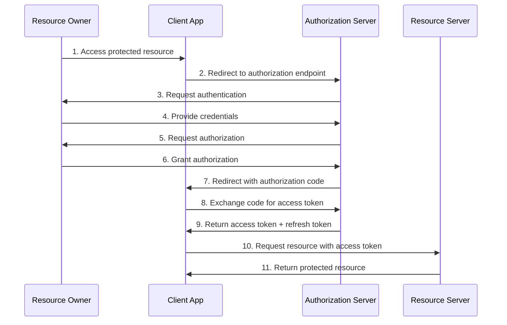
```mermaid
sequenceDiagram
    participant User as Resource Owner
    participant Client as Client App
    participant AuthServer as Authorization Server
    participant ResourceServer as Resource Server

    User->>Client: 1. Access protected resource
    Client->>AuthServer: 2. Redirect to authorization endpoint
    AuthServer->>User: 3. Request authentication
    User->>AuthServer: 4. Provide credentials
    AuthServer->>User: 5. Request authorization
    User->>AuthServer: 6. Grant authorization
    AuthServer->>Client: 7. Redirect with authorization code
    Client->>AuthServer: 8. Exchange code for access token
    AuthServer->>Client: 9. Return access token + refresh token
    Client->>ResourceServer: 10. Request resource with access token
    ResourceServer->>Client: 11. Return protected resource
```

## Grant Types

### Authorization Code

- **Use Case**: Server-side web applications
- **Security**: Most secure grant type
- **Flow**: Client redirects user to authorization server → User authorizes → Server returns authorization code → Client exchanges code for access token
- **Benefits**: Code is short-lived, exchanged server-to-server, not exposed to user agent

### Authorization Code with PKCE (Proof Key for Code Exchange)

- **Use Case**: Mobile apps and Single Page Applications (SPAs)
- **Security**: Prevents authorization code interception attacks
- **Flow**: Similar to Authorization Code, but adds code verifier and challenge
- **Benefits**: Protects against code interception in public clients

### Client Credentials

- **Use Case**: Machine-to-machine communication, service accounts
- **Security**: No user interaction required
- **Flow**: Client authenticates with credentials → Receives access token directly
- **Benefits**: Simple for backend services, no user context needed

### Resource Owner Password Credentials

- **Use Case**: Legacy applications, trusted first-party clients
- **Security**: Less secure, credentials passed directly
- **Flow**: Client sends username/password → Receives access token
- **Note**: Not recommended for third-party applications

### Implicit Grant

- **Use Case**: Legacy SPAs (deprecated)
- **Security**: Access token returned directly in redirect (less secure)
- **Note**: Deprecated in favor of Authorization Code with PKCE

## Tokens

### Access Token

- **Purpose**: Credential used to access protected resources
- **Lifetime**: Short-lived (typically 15 minutes to 1 hour)
- **Scope**: Limited to permissions granted during authorization
- **Storage**: Should be stored securely on client side
- **Transmission**: Sent in `Authorization: Bearer <token>` header

### Refresh Token

- **Purpose**: Used to obtain new access tokens without re-authentication
- **Lifetime**: Longer-lived (days, weeks, or months)
- **Security**: More sensitive, must be stored securely
- **Revocation**: Can be revoked by authorization server
- **Rotation**: Best practice to rotate refresh tokens on each use

### Token Formats

- **JWT (JSON Web Token)**: Self-contained, signed token with claims; verifiable by Resource Server without network call to Authorization Server
- **Opaque Token**: Non-self-describing string; Resource Server must introspect/validate with Authorization Server

## Scopes

Scopes define the specific permissions the client is requesting. Common scopes include:
- `read`: Read-only access
- `write`: Write access
- `admin`: Administrative access
- Custom scopes specific to the application

# JWT (JSON Web Tokens)

JWT is a compact, URL-safe token format used to securely transmit information between parties as a JSON object. This information can be verified and trusted because it is digitally signed.

## JWT Structure

A JWT consists of three parts separated by dots (`.`):

1. **Header**: Contains token type and signing algorithm
2. **Payload**: Contains claims (statements about an entity and additional data)
3. **Signature**: Used to verify the token hasn't been altered

<strong>JWT Structure Diagram</strong>

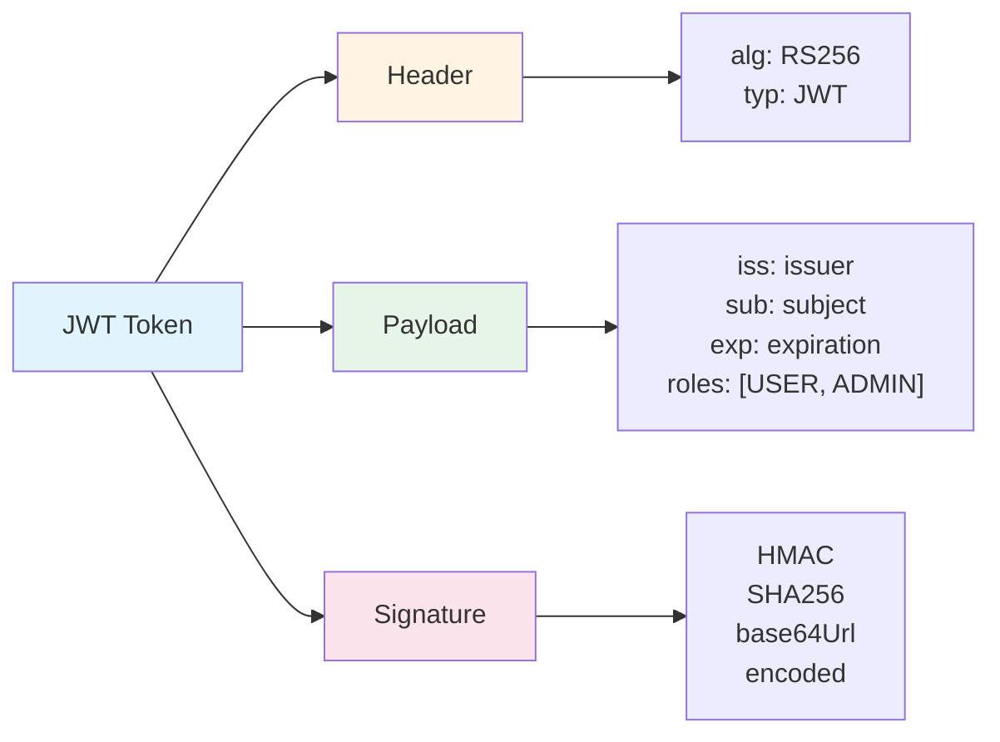
```mermaid
graph LR
    A[JWT Token] --> B[Header]
    A --> C[Payload]
    A --> D[Signature]
    
    B --> B1["alg: RS256<br/>typ: JWT"]
    C --> C1["iss: issuer<br/>sub: subject<br/>exp: expiration<br/>roles: [USER, ADMIN]"]
    D --> D1["HMAC<br/>SHA256<br/>base64Url<br/>encoded"]
    
    style A fill:#e1f5ff
    style B fill:#fff4e1
    style C fill:#e8f5e9
    style D fill:#fce4ec
```

<strong>JWT Token Flow</strong>

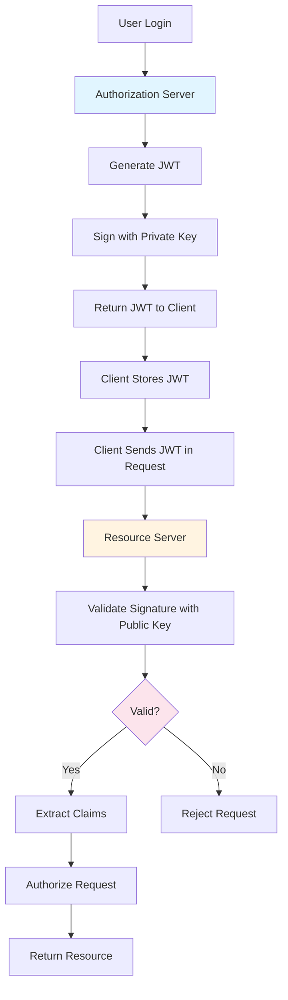
```mermaid
graph TD
    A[User Login] --> B[Authorization Server]
    B --> C[Generate JWT]
    C --> D[Sign with Private Key]
    D --> E[Return JWT to Client]
    E --> F[Client Stores JWT]
    F --> G[Client Sends JWT in Request]
    G --> H[Resource Server]
    H --> I[Validate Signature with Public Key]
    I --> J{Valid?}
    J -->|Yes| K[Extract Claims]
    J -->|No| L[Reject Request]
    K --> M[Authorize Request]
    M --> N[Return Resource]
    
    style B fill:#e1f5ff
    style H fill:#fff4e1
    style J fill:#fce4ec
```

## JWT Claims

### Registered Claims

- `iss` (Issuer): Who issued the token
- `sub` (Subject): Who the token refers to (usually user ID)
- `aud` (Audience): Intended recipient of the token
- `exp` (Expiration Time): When the token expires
- `iat` (Issued At): When the token was issued
- `nbf` (Not Before): Token not valid before this time
- `jti` (JWT ID): Unique identifier for the token

### Public Claims

- Defined in IANA JWT Registry or as URI
- Should be collision-resistant

### Private Claims

- Custom claims agreed upon between parties
- Should avoid collisions with registered/public claims

## JWT Signing Algorithms

### Symmetric (HMAC)

- **Algorithm**: HS256, HS384, HS512
- **Key**: Shared secret between issuer and verifier
- **Use Case**: Single-party systems, internal services
- **Security**: Key must be kept secret by all parties

### Asymmetric (RSA/ECDSA)

- **Algorithm**: RS256, RS384, RS512, ES256, ES384, ES512
- **Key**: Public/private key pair
- **Use Case**: Multi-party systems, distributed services
- **Security**: Private key kept secret, public key shared

## JWT Advantages

- **Stateless**: No server-side session storage required
- **Self-contained**: All necessary information in the token
- **Scalable**: Works well in distributed systems
- **Portable**: Can be used across different domains
- **Verifiable**: Signature ensures integrity

## JWT Disadvantages

- **Size**: Larger than session IDs (can impact performance)
- **Revocation**: Difficult to revoke before expiration
- **Security**: If compromised, valid until expiration
- **Storage**: Sensitive data exposure if not encrypted

## JWT Best Practices

### Token Lifetime

- Keep access tokens short-lived (15-60 minutes)
- Use refresh tokens for longer sessions
- Implement token rotation for enhanced security

### Token Storage

- **Web Applications**: Use httpOnly cookies (most secure) or memory storage
- **Mobile Apps**: Use secure storage (Keychain/Keystore)
- **Never**: Store in localStorage (vulnerable to XSS)

### Token Validation

- Always verify signature
- Check expiration time
- Validate issuer and audience
- Verify token hasn't been tampered with

### Security Considerations

- Use HTTPS for token transmission
- Implement token rotation
- Monitor for token theft/compromise
- Use appropriate signing algorithms (RS256 recommended)
- Consider encryption for sensitive claims (JWE)

# OAuth 2.0 with JWT

Combining OAuth 2.0 with JWT provides a powerful, scalable authentication and authorization solution.

## OAuth 2.0 + JWT Flow

1. **Authorization Request**: Client redirects user to authorization server
2. **User Authentication**: User authenticates with authorization server
3. **Authorization Grant**: Server returns authorization code
4. **Token Exchange**: Client exchanges code for JWT access token
5. **Token Validation**: Resource server validates JWT signature and claims
6. **Resource Access**: Client accesses protected resources with JWT

<strong>OAuth 2.0 with JWT Flow Diagram</strong>

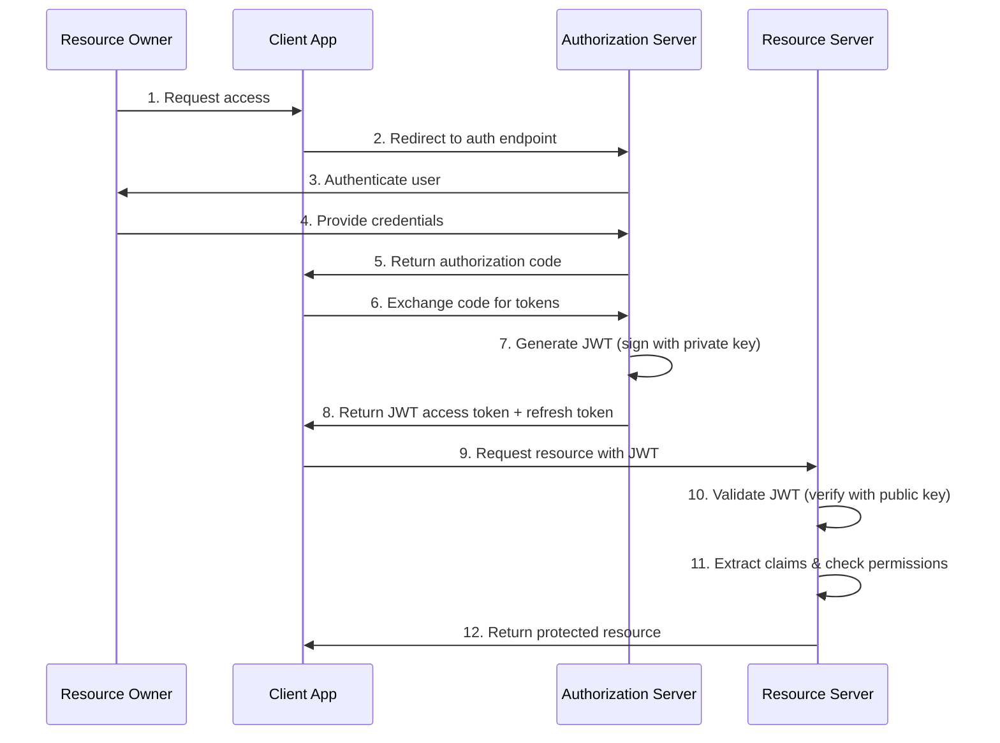
```mermaid
sequenceDiagram
    participant User as Resource Owner
    participant Client as Client App
    participant AuthServer as Authorization Server
    participant ResourceServer as Resource Server

    User->>Client: 1. Request access
    Client->>AuthServer: 2. Redirect to auth endpoint
    AuthServer->>User: 3. Authenticate user
    User->>AuthServer: 4. Provide credentials
    AuthServer->>Client: 5. Return authorization code
    Client->>AuthServer: 6. Exchange code for tokens
    AuthServer->>AuthServer: 7. Generate JWT (sign with private key)
    AuthServer->>Client: 8. Return JWT access token + refresh token
    Client->>ResourceServer: 9. Request resource with JWT
    ResourceServer->>ResourceServer: 10. Validate JWT (verify with public key)
    ResourceServer->>ResourceServer: 11. Extract claims & check permissions
    ResourceServer->>Client: 12. Return protected resource
```

## Benefits of OAuth 2.0 + JWT

- **Stateless Authentication**: No server-side session storage
- **Distributed Systems**: Works across microservices
- **Self-Contained**: Token contains all necessary information
- **Scalability**: No shared session store required
- **Performance**: No database lookup for token validation

## Token Types in OAuth 2.0 + JWT

### Access Token (JWT)

- Contains user identity and permissions
- Short-lived (15-60 minutes)
- Signed by authorization server
- Validated by resource server

### Refresh Token

- Typically opaque (not JWT) for security
- Used to obtain new access tokens
- Longer-lived
- Stored securely on client

### ID Token (OpenID Connect)

- JWT containing user identity information
- Used for authentication (not authorization)
- Part of OpenID Connect specification
- Contains user profile claims

## Common Patterns

### Pattern 1: Resource Server Validates JWT

Resource server validates JWT signature using public key from authorization server. No network call needed for validation.

<strong>Diagram: Resource Server JWT Validation</strong>

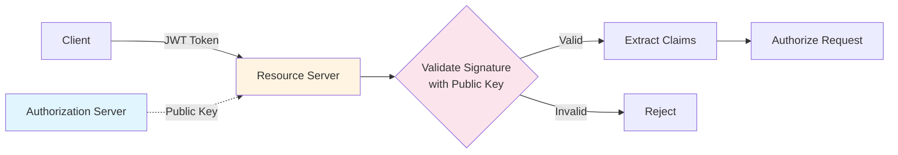
```mermaid
graph LR
    A[Client] -->|JWT Token| B[Resource Server]
    B --> C{Validate Signature<br/>with Public Key}
    C -->|Valid| D[Extract Claims]
    C -->|Invalid| E[Reject]
    D --> F[Authorize Request]
    
    G[Authorization Server] -.->|Public Key| B
    
    style B fill:#fff4e1
    style C fill:#fce4ec
    style G fill:#e1f5ff
```

### Pattern 2: Token Introspection

For opaque tokens or additional validation, resource server calls authorization server's introspection endpoint.

<strong>Diagram: Token Introspection Flow</strong>

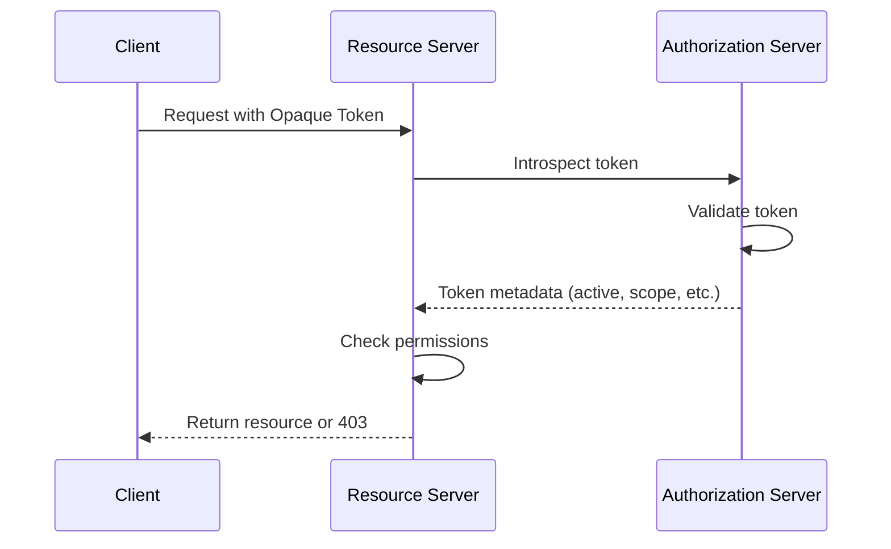
```mermaid
sequenceDiagram
    participant Client
    participant ResourceServer as Resource Server
    participant AuthServer as Authorization Server

    Client->>ResourceServer: Request with Opaque Token
    ResourceServer->>AuthServer: Introspect token
    AuthServer->>AuthServer: Validate token
    AuthServer-->>ResourceServer: Token metadata (active, scope, etc.)
    ResourceServer->>ResourceServer: Check permissions
    ResourceServer-->>Client: Return resource or 403
```

### Pattern 3: Token Refresh

Client uses refresh token to obtain new access token when current token expires, without re-authentication.

<strong>Diagram: Token Refresh Flow</strong>

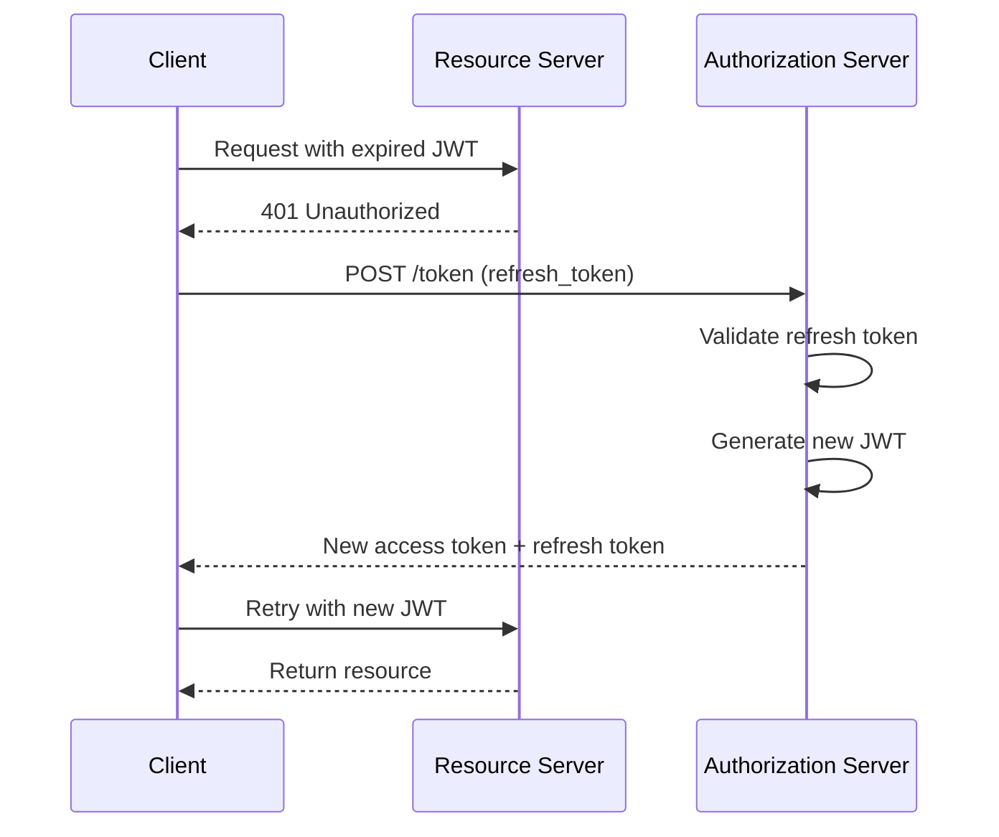
```mermaid
sequenceDiagram
    participant Client
    participant ResourceServer as Resource Server
    participant AuthServer as Authorization Server

    Client->>ResourceServer: Request with expired JWT
    ResourceServer-->>Client: 401 Unauthorized
    Client->>AuthServer: POST /token (refresh_token)
    AuthServer->>AuthServer: Validate refresh token
    AuthServer->>AuthServer: Generate new JWT
    AuthServer-->>Client: New access token + refresh token
    Client->>ResourceServer: Retry with new JWT
    ResourceServer-->>Client: Return resource
```

# Spring Security OAuth2

Spring Security provides comprehensive support for OAuth 2.0 and JWT through Spring Security OAuth2 Resource Server and Authorization Server.

## Spring Security OAuth2 Components

### Resource Server

- Validates OAuth 2.0 access tokens
- Protects REST APIs
- Supports JWT and opaque tokens
- Integrates with Spring Security filter chain

### Authorization Server

- Issues OAuth 2.0 tokens
- Manages client registrations
- Handles user authentication
- Supports multiple grant types
- Can issue JWT or opaque tokens

<strong>Spring Security OAuth2 Architecture</strong>

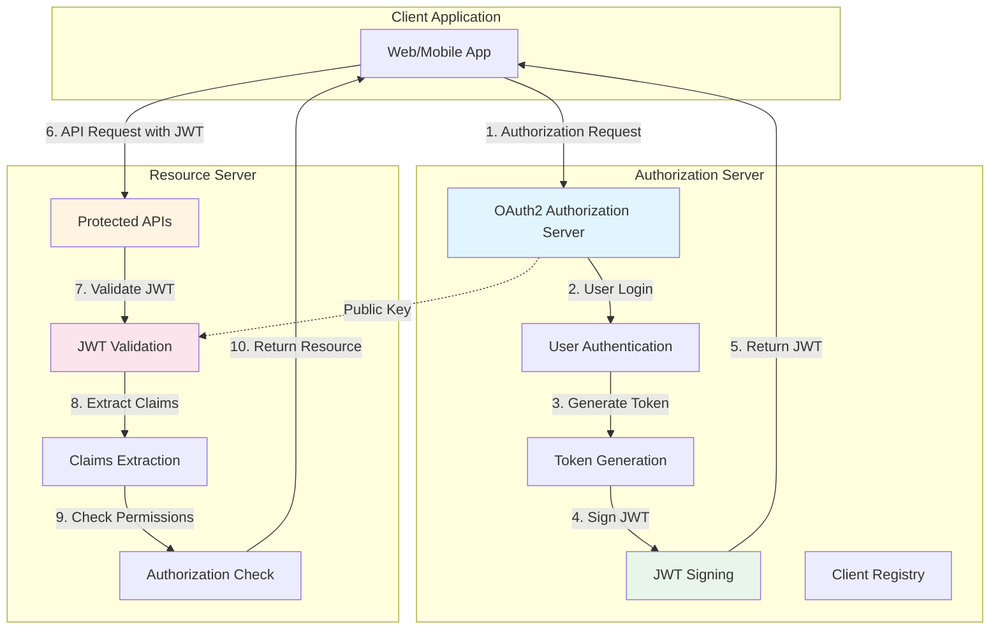
```mermaid
graph TB
    subgraph "Client Application"
        A[Web/Mobile App]
    end
    
    subgraph "Authorization Server"
        B[OAuth2 Authorization Server]
        C[User Authentication]
        D[Token Generation]
        E[JWT Signing]
        F[Client Registry]
    end
    
    subgraph "Resource Server"
        G[Protected APIs]
        H[JWT Validation]
        I[Claims Extraction]
        J[Authorization Check]
    end
    
    A -->|1. Authorization Request| B
    B -->|2. User Login| C
    C -->|3. Generate Token| D
    D -->|4. Sign JWT| E
    E -->|5. Return JWT| A
    A -->|6. API Request with JWT| G
    G -->|7. Validate JWT| H
    H -->|8. Extract Claims| I
    I -->|9. Check Permissions| J
    J -->|10. Return Resource| A
    
    B -.->|Public Key| H
    
    style B fill:#e1f5ff
    style G fill:#fff4e1
    style E fill:#e8f5e9
    style H fill:#fce4ec
```

## Key Features

### JWT Support

- Automatic JWT validation
- Public key resolution (JWK Set endpoint)
- Claim extraction and mapping
- Custom claim validation

### Token Validation

- Signature verification
- Expiration checking
- Issuer and audience validation
- Custom validators

### Security Integration

- Seamless integration with Spring Security
- Method-level security
- Role-based access control
- Security context population

## Common Use Cases

### Use Case 1: Resource Server Only

Application acts as resource server, validating tokens issued by external authorization server (e.g., Keycloak, Auth0).

<strong>Diagram: Resource Server Only</strong>

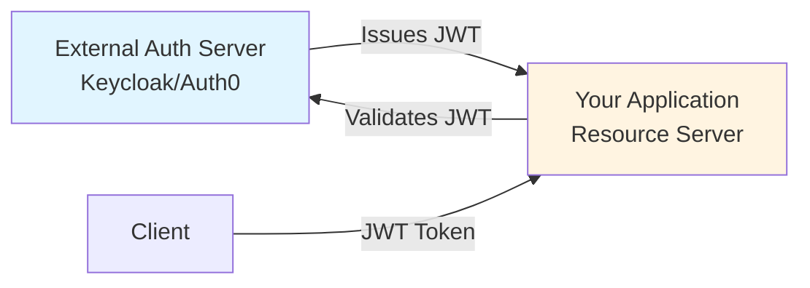
```mermaid
graph LR
    A[External Auth Server<br/>Keycloak/Auth0] -->|Issues JWT| B[Your Application<br/>Resource Server]
    C[Client] -->|JWT Token| B
    B -->|Validates JWT| A
    
    style A fill:#e1f5ff
    style B fill:#fff4e1
```

### Use Case 2: Authorization Server

Application acts as authorization server, issuing tokens for other applications to use.

<strong>Diagram: Authorization Server</strong>

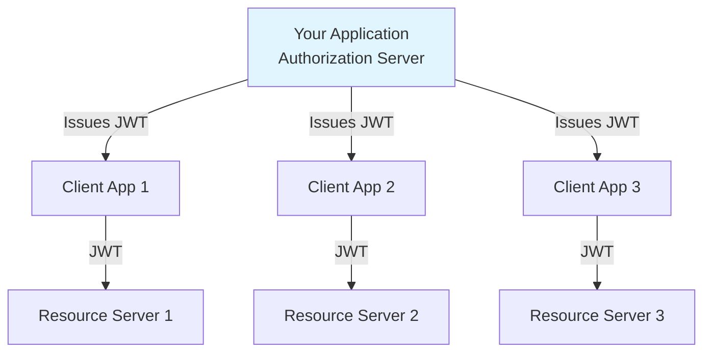
```mermaid
graph TB
    A[Your Application<br/>Authorization Server] -->|Issues JWT| B[Client App 1]
    A -->|Issues JWT| C[Client App 2]
    A -->|Issues JWT| D[Client App 3]
    
    B -->|JWT| E[Resource Server 1]
    C -->|JWT| F[Resource Server 2]
    D -->|JWT| G[Resource Server 3]
    
    style A fill:#e1f5ff
```

### Use Case 3: Combined Server

Application acts as both authorization server and resource server, issuing and validating its own tokens.

<strong>Diagram: Combined Server</strong>

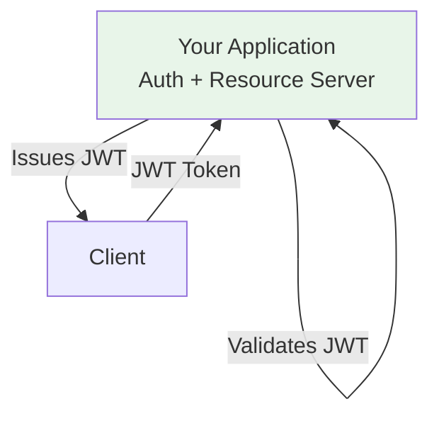
```mermaid
graph TB
    A[Your Application<br/>Auth + Resource Server] -->|Issues JWT| B[Client]
    B -->|JWT Token| A
    A -->|Validates JWT| A
    
    style A fill:#e8f5e9
```

## Best Practices

### Resource Server Configuration

- Configure JWT decoder with issuer URI
- Set up proper security filter chain
- Map JWT claims to Spring Security authorities
- Implement proper error handling

### Token Validation

- Always validate token signature
- Check token expiration
- Verify issuer and audience
- Validate custom claims

### Security Configuration

- Use method security for fine-grained control
- Implement proper CORS configuration
- Configure token extraction from headers
- Set up proper exception handling

### Performance Considerations

- Cache public keys (JWK Set)
- Use appropriate token expiration times
- Consider token caching strategies
- Monitor token validation performance

For implementation details and code examples, see [Spring Security OAuth2 & JWT Implementation](./dev/Spring_Security_OAuth2_JWT.md).

# OKTA

OKTA is a cloud-based identity and access management (IAM) service that provides Single Sign-On (SSO), Multi-Factor Authentication (MFA), and user lifecycle management. It acts as an Identity Provider (IdP) that can integrate with applications using standard protocols like OAuth 2.0, OpenID Connect (OIDC), and SAML.

## Core Concepts

### Identity Provider (IdP)

OKTA serves as a centralized identity provider that manages user authentication and authorization. It eliminates the need for applications to manage user credentials directly.

### Single Sign-On (SSO)

SSO allows users to authenticate once and gain access to multiple applications without re-entering credentials. OKTA provides seamless SSO across all integrated applications.

### User Lifecycle Management

OKTA manages the complete user lifecycle including:
- User provisioning and deprovisioning
- Password management and reset
- Account activation and deactivation
- Profile management

## Key Features

### Authentication Methods

- **Username/Password**: Traditional credential-based authentication
- **Multi-Factor Authentication (MFA)**: Additional security layers (SMS, email, authenticator apps, hardware tokens)
- **Social Login**: Integration with Google, Facebook, Microsoft, etc.
- **Biometric Authentication**: Fingerprint, face recognition
- **Passwordless**: Magic links, push notifications

### Protocols Supported

- **OAuth 2.0**: Authorization framework for delegated access
- **OpenID Connect (OIDC)**: Authentication layer on top of OAuth 2.0
- **SAML 2.0**: XML-based authentication protocol for enterprise SSO
- **LDAP/Active Directory**: Integration with existing directory services

### Application Integration

- **Web Applications**: OAuth 2.0/OIDC integration
- **Mobile Applications**: Native SDK support
- **API Services**: Token-based authentication
- **Legacy Applications**: SAML-based SSO

## OKTA Architecture

<strong>OKTA Architecture Diagram</strong>

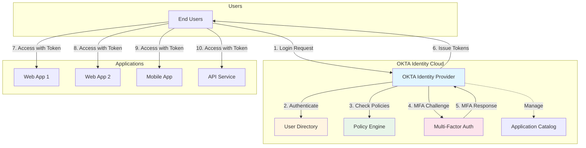
```mermaid
graph TB
    subgraph "Users"
        A[End Users]
    end
    
    subgraph "OKTA Identity Cloud"
        B[OKTA Identity Provider]
        C[User Directory]
        D[Policy Engine]
        E[Multi-Factor Auth]
        F[Application Catalog]
    end
    
    subgraph "Applications"
        G[Web App 1]
        H[Web App 2]
        I[Mobile App]
        J[API Service]
    end
    
    A -->|1. Login Request| B
    B -->|2. Authenticate| C
    B -->|3. Check Policies| D
    B -->|4. MFA Challenge| E
    E -->|5. MFA Response| B
    B -->|6. Issue Tokens| A
    A -->|7. Access with Token| G
    A -->|8. Access with Token| H
    A -->|9. Access with Token| I
    A -->|10. Access with Token| J
    
    B -.->|Manage| F
    
    style B fill:#e1f5ff
    style C fill:#fff4e1
    style D fill:#e8f5e9
    style E fill:#fce4ec
```

## OKTA Integration Patterns

### Pattern 1: OAuth 2.0 / OpenID Connect Integration

Applications use OKTA as the authorization server, implementing OAuth 2.0 flows to obtain access tokens and ID tokens for user authentication.

<strong>OAuth 2.0 / OIDC Flow with OKTA</strong>

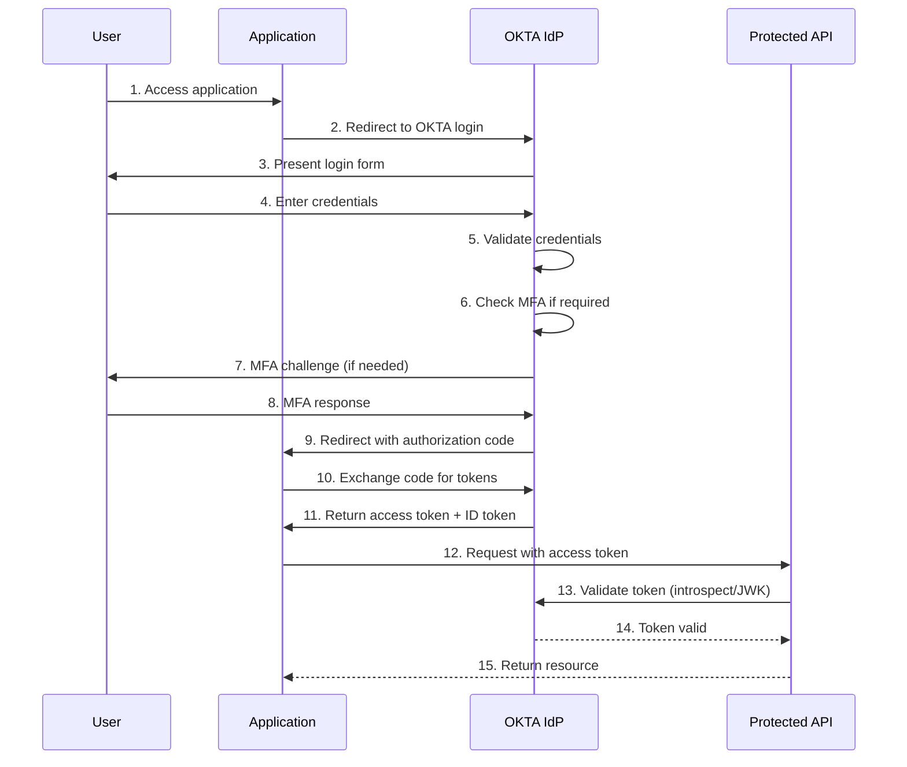
```mermaid
sequenceDiagram
    participant User
    participant App as Application
    participant OKTA as OKTA IdP
    participant API as Protected API

    User->>App: 1. Access application
    App->>OKTA: 2. Redirect to OKTA login
    OKTA->>User: 3. Present login form
    User->>OKTA: 4. Enter credentials
    OKTA->>OKTA: 5. Validate credentials
    OKTA->>OKTA: 6. Check MFA if required
    OKTA->>User: 7. MFA challenge (if needed)
    User->>OKTA: 8. MFA response
    OKTA->>App: 9. Redirect with authorization code
    App->>OKTA: 10. Exchange code for tokens
    OKTA->>App: 11. Return access token + ID token
    App->>API: 12. Request with access token
    API->>OKTA: 13. Validate token (introspect/JWK)
    OKTA-->>API: 14. Token valid
    API-->>App: 15. Return resource
```

### Pattern 2: SAML 2.0 SSO Integration

Enterprise applications use SAML for SSO, with OKTA acting as the Identity Provider.

<strong>SAML 2.0 SSO Flow with OKTA</strong>

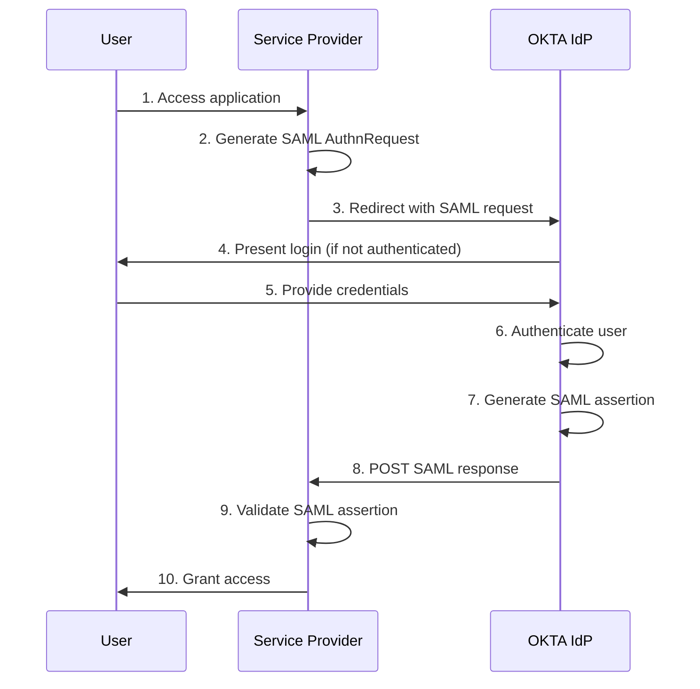
```mermaid
sequenceDiagram
    participant User
    participant App as Service Provider
    participant OKTA as OKTA IdP

    User->>App: 1. Access application
    App->>App: 2. Generate SAML AuthnRequest
    App->>OKTA: 3. Redirect with SAML request
    OKTA->>User: 4. Present login (if not authenticated)
    User->>OKTA: 5. Provide credentials
    OKTA->>OKTA: 6. Authenticate user
    OKTA->>OKTA: 7. Generate SAML assertion
    OKTA->>App: 8. POST SAML response
    App->>App: 9. Validate SAML assertion
    App->>User: 10. Grant access
```

### Pattern 3: API Access Token

Applications use OKTA-issued access tokens to authenticate API requests.

<strong>API Access Token Flow</strong>

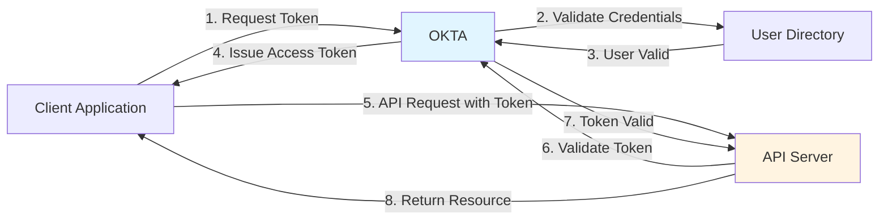
```mermaid
graph LR
    A[Client Application] -->|1. Request Token| B[OKTA]
    B -->|2. Validate Credentials| C[User Directory]
    C -->|3. User Valid| B
    B -->|4. Issue Access Token| A
    A -->|5. API Request with Token| D[API Server]
    D -->|6. Validate Token| B
    B -->|7. Token Valid| D
    D -->|8. Return Resource| A
    
    style B fill:#e1f5ff
    style D fill:#fff4e1
```

## OKTA Components

### Applications

Applications registered in OKTA represent the services that users can access. Each application has:
- **Application Type**: Web, Native, API, Browser plugin
- **Sign-on Method**: OAuth 2.0, SAML, SWA (Secure Web Authentication)
- **Credentials**: Client ID, Client Secret, Redirect URIs
- **Assignment**: Users and groups assigned to the application

### Users and Groups

- **Users**: Individual user accounts with profiles, credentials, and attributes
- **Groups**: Collections of users for easier management and assignment
- **Directory Integration**: Sync with Active Directory, LDAP, or other directories

### Policies

- **Authentication Policies**: Define authentication requirements (MFA, password complexity)
- **Sign-On Policies**: Control how users access applications
- **Password Policies**: Password requirements and expiration rules
- **MFA Policies**: Multi-factor authentication requirements

### Factors

- **SMS**: Text message-based verification
- **Email**: Email-based verification
- **OKTA Verify**: Push notification authenticator app
- **Google Authenticator**: TOTP-based authenticator
- **Hardware Tokens**: Physical security keys (YubiKey, etc.)

## Best Practices

### Application Configuration

- Use appropriate grant types (Authorization Code for web apps, PKCE for mobile/SPA)
- Configure secure redirect URIs (exact match, HTTPS)
- Set appropriate token lifetimes based on security requirements
- Use scopes to limit application permissions

### Security Configuration

- Enable MFA for sensitive applications
- Implement session management policies
- Use strong password policies
- Enable threat detection and anomaly detection
- Configure IP restrictions when possible

### Token Management

- Use short-lived access tokens (15-60 minutes)
- Implement refresh token rotation
- Store tokens securely (httpOnly cookies, secure storage)
- Validate tokens on every request
- Implement proper token revocation

### User Management

- Automate user provisioning and deprovisioning
- Implement just-in-time (JIT) user provisioning
- Sync user attributes from source systems
- Implement role-based access control (RBAC)
- Regular access reviews and certifications

## Common Use Cases

### Use Case 1: Enterprise SSO

Organizations use OKTA to provide single sign-on across multiple enterprise applications, reducing password fatigue and improving security.

### Use Case 2: Customer Identity (CIAM)

Businesses use OKTA Customer Identity to manage customer authentication, registration, and profile management for customer-facing applications.

### Use Case 3: Developer Authentication

APIs and developer portals use OKTA to authenticate developers and manage API access tokens.

### Use Case 4: Workforce Identity

Organizations manage employee access to internal applications, cloud services, and resources through OKTA Workforce Identity.

## Security Considerations

- **Token Security**: Protect access tokens and refresh tokens from theft
- **MFA Enforcement**: Require MFA for sensitive applications and high-risk scenarios
- **Session Management**: Implement proper session timeout and concurrent session limits
- **Audit Logging**: Monitor authentication events and access patterns
- **Threat Detection**: Leverage OKTA's threat detection capabilities
- **Compliance**: Ensure compliance with regulations (GDPR, HIPAA, SOC 2)

For implementation details and code examples, see [OKTA Implementation](./dev/OKTA.md).

# Session-Based Authentication

Session-based authentication is a stateful authentication mechanism where the server maintains session state and identifies users through session identifiers (typically stored in cookies).

<strong>Session vs Token Authentication</strong>

```mermaid
graph TB
    subgraph "Session-Based Authentication"
        A1[User Login] --> B1[Server Creates Session]
        B1 --> C1[Session ID in Cookie]
        C1 --> D1[Server Validates Session]
        D1 --> E1[Session Store Lookup]
        E1 --> F1[Grant Access]
    end
    
    subgraph "Token-Based Authentication (JWT)"
        A2[User Login] --> B2[Server Issues JWT]
        B2 --> C2[JWT Token]
        C2 --> D2[Server Validates JWT]
        D2 --> E2[Verify Signature]
        E2 --> F2[Extract Claims]
        F2 --> G2[Grant Access]
    end
    
    style B1 fill:#fff4e1
    style E1 fill:#e1f5ff
    style B2 fill:#e8f5e9
    style E2 fill:#fce4ec
```

## How Session Authentication Works

1. **Login**: User provides credentials → Server validates → Creates session → Stores session data → Returns session ID (cookie)
2. **Subsequent Requests**: Client sends session ID (cookie) → Server validates session → Grants access
3. **Logout**: Server invalidates session → Client removes cookie

<strong>Session Authentication Flow</strong>

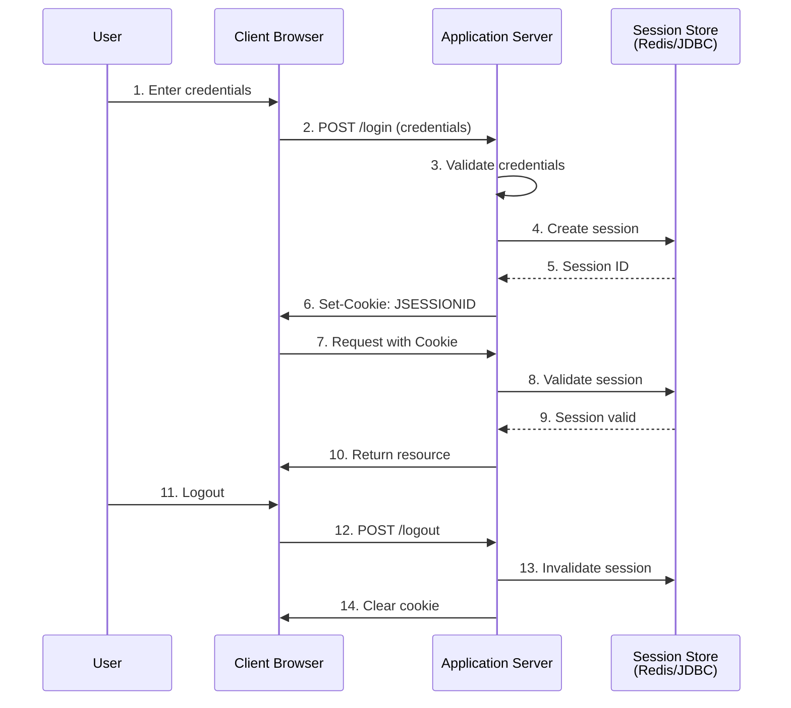
```mermaid
sequenceDiagram
    participant User as User
    participant Client as Client Browser
    participant Server as Application Server
    participant SessionStore as Session Store<br/>(Redis/JDBC)

    User->>Client: 1. Enter credentials
    Client->>Server: 2. POST /login (credentials)
    Server->>Server: 3. Validate credentials
    Server->>SessionStore: 4. Create session
    SessionStore-->>Server: 5. Session ID
    Server->>Client: 6. Set-Cookie: JSESSIONID
    Client->>Server: 7. Request with Cookie
    Server->>SessionStore: 8. Validate session
    SessionStore-->>Server: 9. Session valid
    Server->>Client: 10. Return resource
    User->>Client: 11. Logout
    Client->>Server: 12. POST /logout
    Server->>SessionStore: 13. Invalidate session
    Server->>Client: 14. Clear cookie
```

## Spring Session Framework

Spring Session provides an API and implementations for managing user session information, abstracting away from the servlet container's session management.

### Key Benefits

- **Container Independence**: Works across different servlet containers (Tomcat, Jetty, etc.)
- **Distributed Sessions**: Store sessions in Redis, JDBC, MongoDB, or Hazelcast for clustered deployments
- **RESTful APIs**: Support for session management in REST APIs
- **WebSocket Support**: Maintain session state in WebSocket connections

### Session Storage Options

- **Redis**: Fast, in-memory storage ideal for distributed systems
- **JDBC**: Database-backed storage for persistence and auditability
- **MongoDB**: Document-based storage for flexible session data
- **Hazelcast**: In-memory data grid for high-performance clustering

### Session Lifecycle

1. **Creation**: Session created upon successful authentication
2. **Access**: Session validated on each request
3. **Refresh**: Last accessed time updated
4. **Expiration**: Session invalidated after timeout period
5. **Destruction**: Session removed from storage

### Best Practices

#### Session Timeout

- Set appropriate timeout based on application security requirements
- Typical values: 15-30 minutes for sensitive applications, 1-2 hours for general use
- Consider user activity patterns when setting timeout

#### Secure Cookie Configuration

- Use `HttpOnly` flag to prevent XSS attacks
- Use `Secure` flag for HTTPS-only transmission
- Set `SameSite` attribute to prevent CSRF attacks
- Use custom cookie names to avoid fingerprinting

#### Concurrent Session Control

- Limit number of concurrent sessions per user
- Choose between blocking new logins or invalidating oldest session
- Track active sessions for security monitoring

#### Session Fixation Protection

- Always change session ID after authentication
- Use `changeSessionId()` strategy (default in Spring Security)
- Prevents attackers from hijacking pre-authentication sessions

#### Session Storage Considerations

- **In-Memory**: Fast but lost on restart, not suitable for clustering
- **Redis**: Fast, distributed, requires Redis infrastructure
- **JDBC**: Persistent, auditable, but slower than in-memory
- **MongoDB**: Flexible schema, good for complex session data

### Common Patterns

#### Pattern 1: Distributed Session Clustering

Use external session store (Redis/JDBC) to share sessions across multiple application instances. Essential for horizontal scaling and high availability.

<strong>Diagram: Distributed Session Clustering</strong>

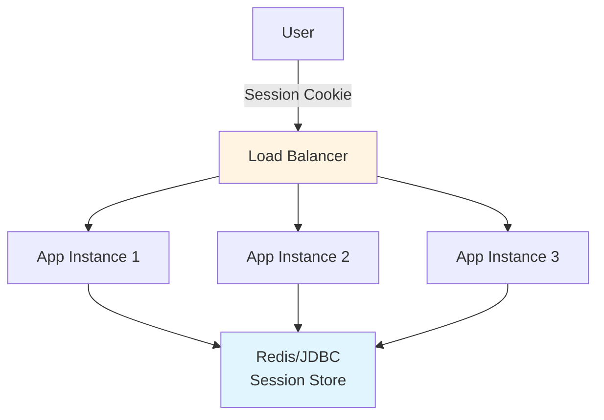
```mermaid
graph TB
    A[Load Balancer] --> B[App Instance 1]
    A --> C[App Instance 2]
    A --> D[App Instance 3]
    
    B --> E[Redis/JDBC<br/>Session Store]
    C --> E
    D --> E
    
    F[User] -->|Session Cookie| A
    
    style E fill:#e1f5ff
    style A fill:#fff4e1
```

#### Pattern 2: Remember Me Functionality

Extend session lifetime for trusted devices using persistent tokens. Separate from main session timeout for better security.

<strong>Diagram: Remember Me Functionality</strong>

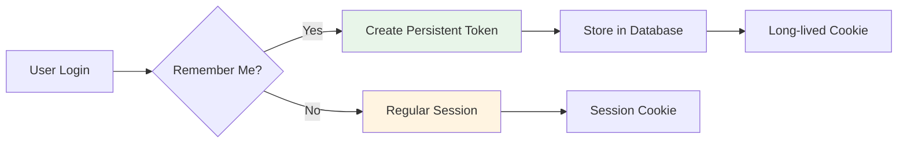
```mermaid
graph LR
    A[User Login] --> B{Remember Me?}
    B -->|Yes| C[Create Persistent Token]
    B -->|No| D[Regular Session]
    C --> E[Store in Database]
    E --> F[Long-lived Cookie]
    D --> G[Session Cookie]
    
    style C fill:#e8f5e9
    style D fill:#fff4e1
```

#### Pattern 3: Session Management API

Provide REST endpoints for session introspection and management. Useful for admin interfaces and security monitoring.

<strong>Diagram: Session Management API</strong>

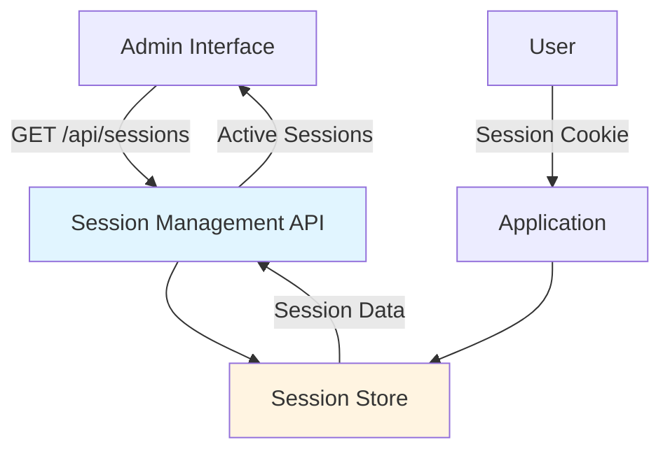
```mermaid
graph TB
    A[Admin Interface] -->|GET /api/sessions| B[Session Management API]
    B --> C[Session Store]
    C -->|Session Data| B
    B -->|Active Sessions| A
    
    D[User] -->|Session Cookie| E[Application]
    E --> C
    
    style B fill:#e1f5ff
    style C fill:#fff4e1
```

### Security Considerations

- **Session Hijacking**: Mitigate with secure cookies, HTTPS, and session fixation protection
- **Session Fixation**: Always regenerate session ID after authentication
- **Session Timeout**: Balance security (shorter) with user experience (longer)
- **Concurrent Sessions**: Limit to prevent account sharing and detect suspicious activity
- **Session Storage**: Encrypt sensitive session data, especially in distributed stores

For implementation details and code examples, see [Spring Session Implementation](./dev/Spring_Session.md).

### log4j & gradle find dependency

[Log4Shell Remediation CheatSheet - Snyk](https://snyk.io/wp-content/uploads/cheat-sheet-log4shell-remediation-v6.pdf)

# #Links

[SecureFlag Knowledge Flag](https://knowledge-base.secureflag.com/)

[OWASP Top 10](https://owasp.org/Top10/)

[OWASP API Security Project](https://owasp.org/www-project-api-security/)

[OWASP Cheat Sheet Series](https://cheatsheetseries.owasp.org/)

[PortSwigger](https://portswigger.net/web-security/all-topics)

## OAuth 2.0 & JWT

[OAuth 2.0 Simplified](https://www.oauth.com/)

[OAuth 2.0 Specification](https://oauth.net/2/)

[JWT.io](https://jwt.io/) - JWT debugger and information

[Spring Security OAuth2 Resource Server](https://docs.spring.io/spring-security/reference/servlet/oauth2/resource-server/index.html)

[Spring Security OAuth2 Authorization Server](https://docs.spring.io/spring-security/reference/servlet/oauth2/authorization-server/index.html)

[Spring Security OAuth2 & JWT Implementation](./dev/Spring_Security_OAuth2_JWT.md) - Code examples and implementation details

## OKTA

[OKTA Developer Documentation](https://developer.okta.com/docs/)

[OKTA Spring Boot Integration](https://developer.okta.com/docs/guides/implement-oauth-for-okta/springboot/main/)

[OKTA API Reference](https://developer.okta.com/docs/reference/api/)

[OKTA Java SDK](https://github.com/okta/okta-sdk-java)

[OKTA Implementation](./dev/OKTA.md) - Code examples and implementation details

