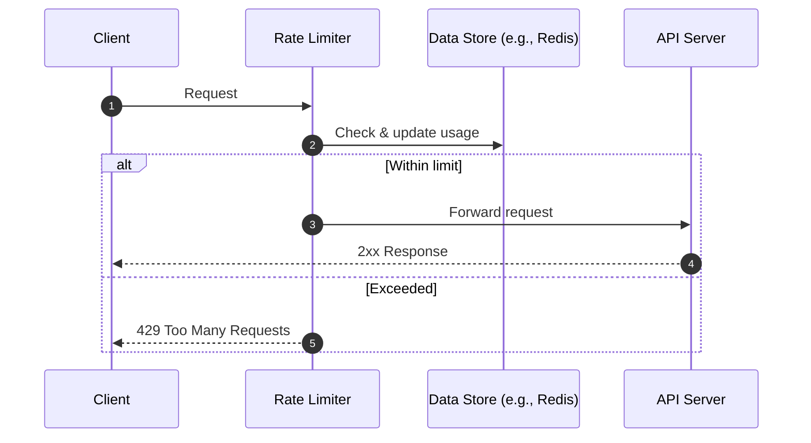

---
tags:
  - Design Patterns
---

## Contents

- [Rate Limiting Strategies](#rate-Limiting-Strategies)

# Design Pattern

## Rate Limiting Strategies

| Strategy | Core Idea | Strength | Trade-off | Typical Fit |  
|---|---|---|---|---|  
| Fixed Window Counter | Count per discrete window | Simple, cheap | Boundary spikes | Basic quotas |  
| Sliding Window Log | Exact per-request timestamps | Most accurate | Memory/CPU heavy | Strict fairness |  
| Sliding Window Counter | Weighted prev/current windows | Efficient, near-accurate | Approximation | High-scale APIs |  
| Token Bucket | Tokens refill at rate $r$, cap $b$ | Allows bursts, easy to distribute | Not constant outflow | Client/API ingress control |  
| Leaky Bucket | FIFO drains at fixed rate | Smooth, protects backend | Queue latency, drops | Downstream protection |  

### Rate Limiting Basics (Request Flow)

# #Link

[Cloud Design Patterns](https://learn.microsoft.com/en-us/azure/architecture/patterns/)

[Design Patterns](https://refactoring.guru/design-patterns)
