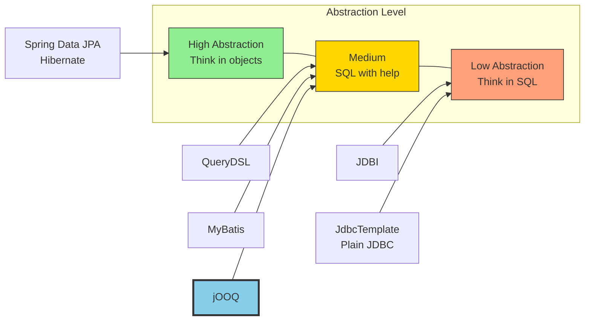
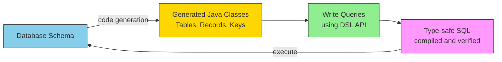
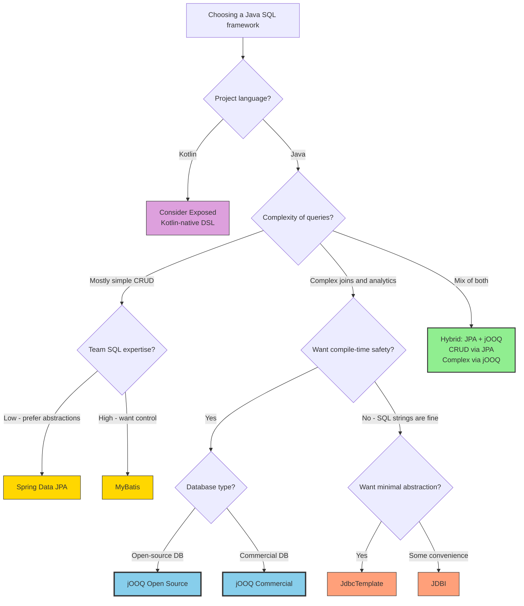
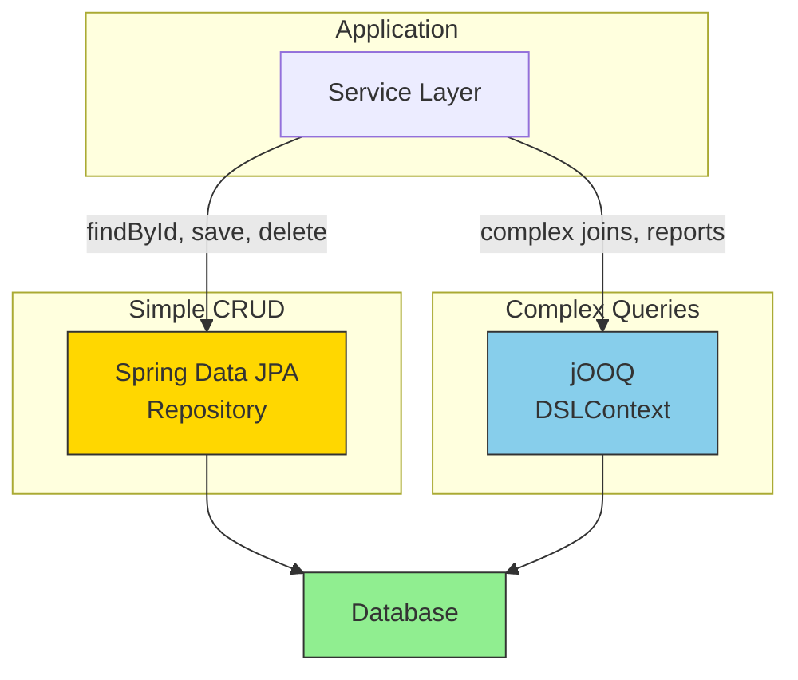

# Java SQL Mapping Frameworks

A comparison of Java frameworks for mapping and executing SQL queries, with a focus on [jOOQ](https://www.jooq.org/) and how it compares to alternatives.

---

## Framework Overview



| Framework | Philosophy | SQL Control | Type Safety |
|-----------|-----------|-------------|-------------|
| **Spring Data JPA / Hibernate** | ORM - think in objects, framework generates SQL | Low | Compile-time (via metamodel) |
| **jOOQ** | SQL-first - write type-safe SQL in Java | High | Compile-time (generated from schema) |
| **QueryDSL** | Type-safe queries on top of JPA or SQL | Medium-High | Compile-time (annotation processing) |
| **MyBatis** | SQL mapper - explicit SQL in XML or annotations | High | Runtime only |
| **JDBI** | Lightweight SQL convenience layer over JDBC | High | Runtime only |
| **JdbcTemplate** | Thin wrapper over JDBC | Full | Runtime only |
| **Exposed (Kotlin)** | DSL + DAO for Kotlin, similar philosophy to jOOQ | High | Compile-time |

---

## jOOQ - In Depth

[jOOQ](https://www.jooq.org/) (Java Object Oriented Querying) takes a **SQL-first** approach: your database schema is the source of truth, and jOOQ generates Java classes from it so you can write type-safe SQL directly in Java.

### How It Works



### Code Example

```java
// jOOQ: type-safe, SQL-first
Result<Record> result = dsl
    .select(POLICY.ID, POLICY.NAME, CLIENT.EMAIL)
    .from(POLICY)
    .join(CLIENT).on(POLICY.CLIENT_ID.eq(CLIENT.ID))
    .where(POLICY.STATUS.eq("ACTIVE"))
    .and(POLICY.CREATED_AT.greaterThan(LocalDate.of(2025, 1, 1)))
    .orderBy(POLICY.NAME.asc())
    .fetch();
```

Compare with the equivalent in other frameworks:

```java
// Spring Data JPA: object-oriented, but complex queries get awkward
@Query("SELECT p FROM Policy p JOIN p.client c " +
       "WHERE p.status = :status AND p.createdAt > :date ORDER BY p.name")
List<Policy> findActiveAfter(@Param("status") String status,
                              @Param("date") LocalDate date);
```

```java
// JdbcTemplate: raw SQL strings, no compile-time safety
jdbcTemplate.query(
    "SELECT p.id, p.name, c.email FROM policy p " +
    "JOIN client c ON p.client_id = c.id " +
    "WHERE p.status = ? AND p.created_at > ? ORDER BY p.name",
    new Object[]{status, date},
    (rs, rowNum) -> new PolicyDTO(rs.getLong("id"), rs.getString("name"), rs.getString("email"))
);
```

### Licensing

| Edition | License | Databases | Cost |
|---------|---------|-----------|------|
| **Open Source** | Apache 2.0 | Open-source DBs (PostgreSQL, MySQL, MariaDB, H2, SQLite) | Free |
| **Express** | Commercial | + SQL Server, Oracle | Paid |
| **Professional** | Commercial | + DB2, Informix | Paid |
| **Enterprise** | Commercial | All + advanced features | Paid |

For most Spring Boot projects using PostgreSQL or MySQL, the **Open Source edition is sufficient**.

### Spring Boot Integration

Spring Boot has built-in jOOQ auto-configuration via `spring-boot-starter-jooq`:

```xml
<dependency>
    <groupId>org.springframework.boot</groupId>
    <artifactId>spring-boot-starter-jooq</artifactId>
</dependency>
```

Spring Boot auto-configures a `DSLContext` bean connected to your `DataSource`. Customize dialect via:

```yaml
spring:
  jooq:
    sql-dialect: POSTGRES
```

### jOOQ Resources

- [Official Documentation](https://www.jooq.org/doc/latest/manual/)
- [jOOQ Blog](https://blog.jooq.org/) -- excellent deep-dive articles by Lukas Eder
- [Spring Boot + jOOQ Guide](https://docs.spring.io/spring-boot/reference/data/sql.html#data.sql.jooq)
- [GitHub Repository](https://github.com/jOOQ/jOOQ)
- [DSL API Reference](https://www.jooq.org/doc/latest/manual/sql-building/dsl-api/)
- [Code Generation Config](https://www.jooq.org/doc/latest/manual/code-generation/codegen-configuration/)

---

## Framework-by-Framework Comparison

### Spring Data JPA / Hibernate

The default choice in the Spring ecosystem. Full ORM -- you model entities as Java classes and the framework generates SQL.

**Strengths:**
- Fastest development for simple CRUD
- Huge community, extensive documentation
- First-class Spring Boot integration
- Automatic schema generation, migrations (via Flyway/Liquibase)
- Caching (L1 + L2), lazy loading, dirty checking

**Weaknesses:**
- N+1 query problems are extremely common and hard to detect
- Generated SQL can be unpredictable and inefficient
- Complex queries (joins, aggregations, window functions) are awkward via JPQL/Criteria API
- "Magic" behavior (lazy loading proxies, flush timing) causes subtle bugs
- Heavy runtime overhead

**Resources:**
- [Hibernate Documentation](https://hibernate.org/orm/documentation/)
- [Spring Data JPA Reference](https://docs.spring.io/spring-data/jpa/reference/)
- [Vlad Mihalcea's Blog](https://vladmihalcea.com/) -- deep Hibernate expertise

### QueryDSL

Type-safe query generation using annotation processing. Can work on top of JPA, SQL, or MongoDB.

**Strengths:**
- Type-safe queries without code generation from DB schema
- Works on top of existing JPA entities
- Fluent, readable API
- Good for adding type-safety to existing JPA projects

**Weaknesses:**
- Project maintenance has been inconsistent (slow releases)
- Less powerful than jOOQ for advanced SQL features
- Still limited by JPA's SQL generation when used with JPA backend
- Cannot easily extract raw SQL strings for debugging

**Resources:**
- [QueryDSL Documentation](http://querydsl.com/)
- [GitHub Repository](https://github.com/querydsl/querydsl)

### MyBatis

SQL mapper framework -- you write SQL explicitly (in XML or annotations) and MyBatis maps results to Java objects.

**Strengths:**
- Full SQL control -- you write every query
- Good for teams with strong SQL skills
- Stored procedure support
- Dynamic SQL building via XML tags
- Lighter than Hibernate

**Weaknesses:**
- XML mapping files are verbose and tedious
- No compile-time SQL validation
- Manual result mapping
- SQL scattered across XML files can be hard to maintain

**Resources:**
- [MyBatis Documentation](https://mybatis.org/mybatis-3/)
- [MyBatis-Spring Integration](https://mybatis.org/spring/)
- [GitHub Repository](https://github.com/mybatis/mybatis-3)

### JDBI

Lightweight convenience layer over JDBC. Designed to be "what JDBC should have been."

**Strengths:**
- Very lightweight, minimal abstraction
- Fluent API for queries and updates
- Declarative SQL via annotated interfaces
- Easy to learn if you know SQL
- No magic, predictable behavior

**Weaknesses:**
- No type-safe query building
- No code generation or schema awareness
- Manual SQL string management
- Smaller community than other options

**Resources:**
- [JDBI Documentation](https://jdbi.org/)
- [GitHub Repository](https://github.com/jdbi/jdbi)

### JdbcTemplate (Spring)

Spring's thin wrapper over raw JDBC. Handles connection management, exception translation, and resource cleanup.

**Strengths:**
- Minimal overhead, closest to raw JDBC
- Full SQL control
- No learning curve beyond SQL itself
- Part of Spring -- no extra dependencies
- Predictable performance

**Weaknesses:**
- Very verbose, lots of boilerplate
- No type-safety for queries
- Manual row mapping for every query
- Error-prone SQL string concatenation
- No query building assistance

**Resources:**
- [JdbcTemplate Reference](https://docs.spring.io/spring-framework/reference/data-access/jdbc/core.html)

### Exposed (Kotlin)

JetBrains' SQL framework for Kotlin. Offers both DSL (type-safe SQL) and DAO (ORM-like) APIs.

**Strengths:**
- Two APIs: DSL for SQL-first, DAO for ORM-like usage
- Kotlin-native (null safety, coroutines support)
- Lightweight, actively maintained by JetBrains
- Good if your project is Kotlin-based

**Weaknesses:**
- Kotlin only -- not usable from Java
- Smaller community than JPA or jOOQ
- Less mature than established Java frameworks

**Resources:**
- [Exposed Documentation](https://www.jetbrains.com/help/exposed/about.html)
- [GitHub Repository](https://github.com/JetBrains/Exposed)

---

## Complexity Comparison

### Setup Complexity

```mermaid
graph TD
    subgraph Setup["Setup Complexity - from simplest to most involved"]
        JDBC_S["JdbcTemplate<br>Add dependency, inject, write SQL"]
        JDBI_S["JDBI<br>Add dependency, configure, write SQL"]
        MYBATIS_S["MyBatis<br>Add dependency, write XML mappers or annotations"]
        JPA_S["Spring Data JPA<br>Add dependency, define entities,<br>create repositories"]
        QDS_S["QueryDSL<br>Add dependency, configure annotation<br>processor, generate Q-classes"]
        JOOQ_S["jOOQ<br>Add dependency, configure code<br>generation plugin, run against DB"]
    end

    JDBC_S -->|simple| JDBI_S
    JDBI_S -->|moderate| MYBATIS_S
    MYBATIS_S -->|moderate| JPA_S
    JPA_S -->|moderate-high| QDS_S
    QDS_S -->|high initial| JOOQ_S

    style JDBC_S fill:#90EE90,stroke:#333
    style JDBI_S fill:#b8e6b8,stroke:#333
    style MYBATIS_S fill:#FFD700,stroke:#333
    style JPA_S fill:#FFD700,stroke:#333
    style QDS_S fill:#FFA07A,stroke:#333
    style JOOQ_S fill:#FFA07A,stroke:#333
```



### Complexity Breakdown

| Dimension | JdbcTemplate | JDBI | MyBatis | Spring Data JPA | QueryDSL | jOOQ |
|-----------|:---:|:---:|:---:|:---:|:---:|:---:|
| **Initial setup** | Very Low | Low | Medium | Low | Medium-High | High |
| **Learning curve** | Low | Low | Medium | Medium | Medium | Medium-High |
| **Simple CRUD** | Verbose | Simple | Medium | Very Simple | Simple | Medium |
| **Complex queries** | Manual SQL | Manual SQL | Manual SQL | Difficult | Good | Excellent |
| **Compile-time safety** | None | None | None | Partial | Yes | Yes |
| **SQL visibility** | Full | Full | Full | Hidden | Partial | Full |
| **Build pipeline impact** | None | None | None | None | Annotation processor | DB-dependent code gen |
| **Debugging ease** | Easy | Easy | Medium | Hard | Medium | Easy |
| **Ongoing maintenance** | High | Medium | Medium | Low | Medium | Low-Medium |
| **Team SQL knowledge needed** | High | High | High | Low | Medium | High |

### Complexity Rating (1-5 scale)

```
Setup Complexity (lower is simpler)
  5 |                              ████
  4 |                        ████  ████
  3 |            ████  ████  ████  ████
  2 |      ████  ████  ████  ████  ████
  1 | ████  ████  ████  ████  ████  ████
    +------+------+------+------+------+------
     JDBC   JDBI  MyBatis  JPA  QueryDSL jOOQ
    Template

Day-to-Day Complexity (lower is simpler)
  5 |
  4 | ████
  3 | ████  ████  ████              ████
  2 | ████  ████  ████  ████  ████  ████
  1 | ████  ████  ████  ████  ████  ████
    +------+------+------+------+------+------
     JDBC   JDBI  MyBatis  JPA  QueryDSL jOOQ
    Template

Complex Query Capability (higher is better)
  5 | ████  ████  ████              ████
  4 | ████  ████  ████        ████  ████
  3 | ████  ████  ████  ████  ████  ████
  2 | ████  ████  ████  ████  ████  ████
  1 | ████  ████  ████  ████  ████  ████
    +------+------+------+------+------+------
     JDBC   JDBI  MyBatis  JPA  QueryDSL jOOQ
    Template
```

### Key Complexity Trade-offs

**jOOQ** has the highest **initial setup complexity** because:
1. Requires a running database (or schema file) at build time for code generation
2. Build plugin configuration (Maven/Gradle) to run the code generator
3. Generated code must be kept in sync with schema migrations
4. Commercial license needed for proprietary databases

But jOOQ has **low ongoing complexity** because:
1. Compile-time catches SQL errors -- no runtime surprises
2. IDE auto-completion guides query construction
3. Generated code makes refactoring safe -- rename a column and the compiler tells you everywhere it breaks
4. SQL is visible and predictable -- no ORM "magic"

**Spring Data JPA** has the lowest **initial setup complexity** but the highest **hidden complexity**:
1. Simple CRUD is nearly zero-effort (just define an interface)
2. But N+1 queries, lazy loading exceptions, flush timing, proxy behavior, and unpredictable SQL create hard-to-debug production issues
3. Complex queries require JPQL, Criteria API, or native queries -- losing the ORM benefit

---

## Decision Flowchart



---

## Hybrid Approach: JPA + jOOQ

A popular pattern in Spring Boot projects is to **use both JPA and jOOQ together**:

- **Spring Data JPA** for simple CRUD operations, entity management, and caching
- **jOOQ** for complex queries, reporting, analytics, and performance-critical paths



This gives you the best of both worlds: rapid development for simple operations and full SQL power where you need it.

---

## Summary

| If you need... | Use |
|----------------|-----|
| Fastest development, simple CRUD | **Spring Data JPA** |
| Type-safe SQL with full control | **jOOQ** |
| Best of both worlds | **JPA + jOOQ hybrid** |
| Explicit SQL in XML/annotations | **MyBatis** |
| Minimal abstraction over JDBC | **JdbcTemplate** or **JDBI** |
| Kotlin-native SQL DSL | **Exposed** |
| Type-safe queries over existing JPA entities | **QueryDSL** |

**jOOQ stands out** when you need complex queries with compile-time safety and predictable SQL. Its initial setup is the most involved (code generation from database), but this investment pays off in fewer runtime surprises, safer refactoring, and better debugging. For projects that are query-heavy or performance-sensitive, jOOQ is an excellent choice -- especially when paired with JPA for simple CRUD in a hybrid setup.

---

## Further Reading

| Topic | Link |
|-------|------|
| Spring Data JPA vs jOOQ vs JdbcTemplate | [Medium: Choosing Your Data Access Layer](https://medium.com/@niteshthakur498/spring-data-jpa-vs-jooq-vs-jdbc-template-choosing-your-data-access-layer-21399ec439a8) |
| Hibernate vs jOOQ vs MyBatis performance | [Medium: Comparing for High-Performance Queries](https://medium.com/@ShantKhayalian/comparing-hibernate-vs-jooq-vs-mybatis-for-high-performance-database-queries-e60d5ea47212) |
| ORM Battle 2025: Hibernate vs jOOQ vs JDBC | [Medium: The Great ORM Debate](https://medium.com/javarevisited/the-great-orm-debate-hibernate-vs-jooq-vs-plain-jdbc-e271b95a2ef5) |
| Is jOOQ a better fit than JPA? | [DevGenius: Rethinking ORM](https://blog.devgenius.io/rethinking-orm-is-jooq-a-better-fit-than-jpa-for-your-project-7f1ead342f64) |
| Spring Boot: JPA vs JDBC vs jOOQ | [HackerNoon: Comparing Approaches](https://hackernoon.com/comparing-database-integration-approaches-in-spring-boot-spring-data-jpa-vs-spring-jdbc-vs-jooq) |
| When to choose JPA vs jOOQ | [Medium: The Great Debate](https://medium.com/@mesfandiari77/the-great-debate-when-to-choose-jpa-hibernate-vs-jooq-in-your-spring-boot-app-6e5f549fd5dd) |
| jOOQ vs JDBC official comparison | [jOOQ Docs: Comparison with JDBC](https://www.jooq.org/doc/latest/manual/sql-execution/comparison-with-jdbc/) |
| jOOQ Licensing details | [jOOQ Licensing](https://www.jooq.org/legal/licensing) |
| QueryDSL vs jOOQ and others | [StackOverflow: Comparing Query DSLs](https://stackoverflow.com/questions/7242388/comparing-querydsl-jooq-jequel-activejdbc-iciql-and-other-query-dsls) |
